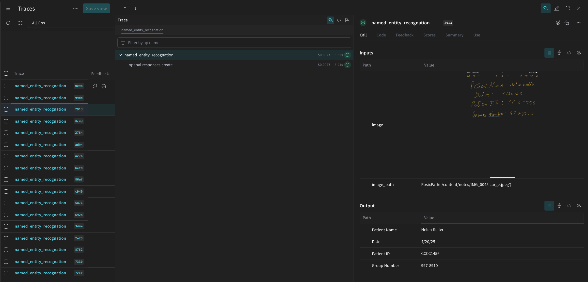
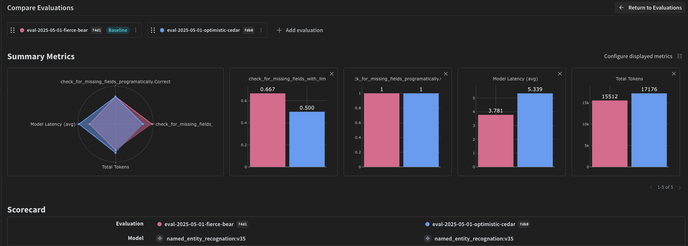

<Note>
This is an interactive notebook. You can run it locally or use the links below:
- [Open in Google Colab](https://colab.research.google.com/github/wandb/weave/blob/master/docs/notebooks/ocr-pipeline.ipynb)
- [View source on GitHub](https://github.com/wandb/weave/blob/master/docs/notebooks/ocr-pipeline.ipynb)
</Note>

##  Prerequisites

Before you begin, install and import the required libraries, get your W&B API key, and initialize your Weave project.

```python
# Install the required dependencies
!pip install openai weave -q
python
import json
import os

from google.colab import userdata
from openai import OpenAI

import weave
python
# Get API Keys
os.environ["OPENAI_API_KEY"] = userdata.get(
    "OPENAI_API_KEY"
)  # please set the keys as collab environment secrets from the menu on the left
os.environ["WANDB_API_KEY"] = userdata.get("WANDB_API_KEY")

# Set project name
# Replace the PROJECT value with your project name
PROJECT = "vlm-handwritten-ner"

# Initiatlize the Weave project
weave.init(PROJECT)
```

## 1. Create and iterate on prompts with Weave

Good prompt engineering is critical to guiding the model to properly extract entities. First, you'll create basic prompt that gives the model the instructions on what to extract from your image data and how to format it. Then, you'll store the promp in Weave for tracking and iteration.

```python
# Create your prompt object with Weave
prompt = """
Extract all readable text from this image. Format the extracted entities as a valid JSON.
Do not return any extra text, just the JSON. Do not include ```json```
Use the following format:
{"Patient Name": "James James","Date": "4/22/2025","Patient ID": "ZZZZZZZ123","Group Number": "3452542525"}
"""
system_prompt = weave.StringPrompt(prompt)
# Publish your prompt to Weave
weave.publish(system_prompt, name="NER-prompt")
```

Next, improve the prompt by adding more instructions and validation rules to help reduce errors in the output.

```python
better_prompt = """
You are a precision OCR assistant. Given an image of patient information, extract exactly these fields into a single JSON object—and nothing else:

- Patient Name
- Date (MM/DD/YYYY)
- Patient ID
- Group Number

Validation rules:
1. Date must match MM/DD/YY; if not, set Date to "".
2. Patient ID must be alphanumeric; if unreadable, set to "".
3. Always zero-pad months and days (e.g. "04/07/25").
4. Omit any markup, commentary, or code fences.
5. Return strictly valid JSON with only those four keys.

Do not return any extra text, just the JSON. Do not include ```json```
Example output:
{"Patient Name":"James James","Date":"04/22/25","Patient ID":"ZZZZZZZ123","Group Number":"3452542525"}
"""
# Edit the prompt
system_prompt = weave.StringPrompt(better_prompt)
# Publish the edited prompt to Weave
weave.publish(system_prompt, name="NER-prompt")
```

## 2. Get the dataset

Next, retrieve the dataset of handwritten notes to serve as input for the OCR pipeline. 

The images in the dataset are already `base64` encoded, which means the data can be used by the LLM without any pre-processing.

```python
# Retrieve the dataset from the following Weave project
dataset = weave.ref(
    "weave:///wandb-smle/vlm-handwritten-ner/object/NER-eval-dataset:G8MEkqWBtvIxPYAY23sXLvqp8JKZ37Cj0PgcG19dGjw"
).get()

# Access a specific example in the dataset
example_image = dataset.rows[3]["image_base64"]

# Display the example_image
from IPython.display import HTML, display

html = f''
display(HTML(html))
```

## 3. Build the NER pipeline

Next, build the NER pipeline. The pipeline will consist of two functions:

1. An `encode_image` function that takes a PIL image from the dataset and returns a `base64` encoded string representation of the image that can be passed to the VLM
2. An `extract_named_entities_from_image` function that takes an image and system prompt and returns the extracted entities from that image as described by the system prompt

```python
# Traceable function using GPT-4-Vision
def extract_named_entities_from_image(image_base64) -> dict:
    # init LLM Client
    client = OpenAI()

    # Setup the instruction prompt
    # You can optionally use a prompt stored in Weave withweave.ref("weave:///wandb-smle/vlm-handwritten-ner/object/NER-prompt:FmCv4xS3RFU21wmNHsIYUFal3cxjtAkegz2ylM25iB8").get().content.strip()
    prompt = better_prompt

    response = client.responses.create(
        model="gpt-4.1",
        input=[
            {
                "role": "user",
                "content": [
                    {"type": "input_text", "text": prompt},
                    {
                        "type": "input_image",
                        "image_url": image_base64,
                    },
                ],
            }
        ],
    )

    return response.output_text
```

Now, create a function called `named_entity_recognation` that:
- Passes the image data to the NER pipeline
- Returns correctly formatted JSON with the results

Use the [`@weave.op()` decorator](https://weave-docs.wandb.ai/reference/python-sdk/weave/trace/weave.trace.op) decorator to automatically track and trace function execution in the W&B UI. 

Every `named_entity_recognation` is run, the full trace results are visible in the Weave UI. To view the traces, navigate to the **Traces** tab of your Weave project. 

```python
# NER Function for evaluations
@weave.op()
def named_entity_recognation(image_base64, id):
    result = {}
    try:
        # 1) call the vision op, get back a JSON string
        output_text = extract_named_entities_from_image(image_base64)

        # 2) parse JSON exactly once
        result = json.loads(output_text)

        print(f"Processed: {str(id)}")
    except Exception as e:
        print(f"Failed to process {str(id)}: {e}")
    return result
```

Finally, run the pipeline over the dataset, and view the results.

The following code loops over the dataset and stores the results in a local file `processing_results.json`. The results are also viewable in the Weave UI.

```python
# Output results
results = []

# loop over all images in the dataset
for row in dataset.rows:
    result = named_entity_recognation(row["image_base64"], str(row["id"]))
    result["image_id"] = str(row["id"])
    results.append(result)

# Save all results to a JSON file
output_file = "processing_results.json"
with open(output_file, "w") as f:
    json.dump(results, f, indent=2)

print(f"Results saved to: {output_file}")
```

You will see something similar to the following in the **Traces** table in the Weave UI.



## 4. Evaluate the pipeline using Weave

Now that you have created a pipeline to perform NER using a VLM, you can use Weave to systematically evaluate it and find out how well it performs. You can learn more about Evaluations in Weave in [Evaluations Overview](https://weave-docs.wandb.ai/guides/core-types/evaluations). 

A fundamental part of a Weave Evaluation are [Scorers](https://weave-docs.wandb.ai/guides/evaluation/scorers). Scorers are used to evaluate AI outputs and return evaluation metrics. They take the AI's output, analyze it, and return a dictionary of results. Scorers can use your input data as reference if needed and can also output extra information, such as explanations or reasonings from the evaluation.

In this section, you will create two Scorers to evaluate the pipeline:
1. Programatic Scorer 
2. LLM-as-a-judge Scorer

### Programatic scorer

The programmatic scorer, `check_for_missing_fields_programatically`, will take the model output (the output of the `named_entity_recognition` function), and identify which `keys` are missing or empty in the results.

This check is great for identifying samples where the model missed capturing any fields.

```python
# Add weave.op() to track execution of the scorer
@weave.op()
def check_for_missing_fields_programatically(model_output):
    # Required keys for every entry
    required_fields = {"Patient Name", "Date", "Patient ID", "Group Number"}

    for key in required_fields:
        if (
            key not in model_output
            or model_output[key] is None
            or str(model_output[key]).strip() == ""
        ):
            return False  # This entry has a missing or empty field

    return True  # All required fields are present and non-empty
```

### LLM-as-a-judge scorer

In the next step of the evaluation, both the image data and the model's output are provided to ensure the assessment reflects actual NER performance. The image content is explicitly referenced, not just the model output.

The Scorer used for this step, `check_for_missing_fields_with_llm`, use an LLM to perform scoring (specifically OpenAI's `gpt-4o`). As specified by the contents of the `eval_prompt`, `check_for_missing_fields_with_llm` outputs a `Boolean` value. If all fields match the information in the image and formatting is correct, the Scorer returns `true`. If any field is missing, empty, incorrect, or mismatched, the result is `false`, and the scorer also returns a message explaining the problem.

```python
# The system prompt for the LLM-as-a-judge

eval_prompt = """
You are an OCR validation system. Your role is to assess whether the structured text extracted from an image accurately reflects the information in that image.
Only validate the structured text and use the image as your source of truth.

Expected input text format:
{"Patient Name": "First Last", "Date": "04/23/25", "Patient ID": "131313JJH", "Group Number": "35453453"}

Evaluation criteria:
- All four fields must be present.
- No field should be empty or contain placeholder/malformed values.
- The "Date" should be in MM/DD/YY format (e.g., "04/07/25") (zero padding the date is allowed)

Scoring:
- Return: {"Correct": true, "Reason": ""} if **all fields** match the information in the image and formatting is correct.
- Return: {"Correct": false, "Reason": "EXPLANATION"} if **any** field is missing, empty, incorrect, or mismatched.

Output requirements:
- Respond with a valid JSON object only.
- "Correct" must be a JSON boolean: true or false (not a string or number).
- "Reason" must be a short, specific string indicating all the problem — e.g., "Patient Name mismatch", "Date not zero-padded", or "Missing Group Number".
- Do not return any additional explanation or formatting.

Your response must be exactly one of the following:
{"Correct": true, "Reason": null}
OR
{"Correct": false, "Reason": "EXPLANATION_HERE"}
"""

# Add weave.op() to track execution of the Scorer
@weave.op()
def check_for_missing_fields_with_llm(model_output, image_base64):
    client = OpenAI()
    response = client.chat.completions.create(
        model="gpt-4o",
        messages=[
            {"role": "developer", "content": [{"text": eval_prompt, "type": "text"}]},
            {
                "role": "user",
                "content": [
                    {
                        "type": "image_url",
                        "image_url": {
                            "url": image_base64,
                        },
                    },
                    {"type": "text", "text": str(model_output)},
                ],
            },
        ],
        response_format={"type": "json_object"},
    )
    response = json.loads(response.choices[0].message.content)
    return response
```

## 5. Run the Evaluation

Finally, define an evaluation call that will automatically loop over the `dataset` passed and log the results together in the Weave UI.

The following code kicks off the evaluation and applies the two Scorers to every output from the NER pipeline. Results are visible in the **Evals** tab in the Weave UI.

```python
evaluation = weave.Evaluation(
    dataset=dataset,
    scorers=[
        check_for_missing_fields_with_llm,
        check_for_missing_fields_programatically,
    ],
    name="Evaluate_4.1_NER",
)

print(await evaluation.evaluate(named_entity_recognation))
```

When the above code is run, a link to the Evaluation table in the Weave UI is generated. Follow the link to view the results and compare different iterations of the pipeline across models, prompts, and datasets of your choice. The Weave UI automatically creates a visualization like the one shown below for your team.   

