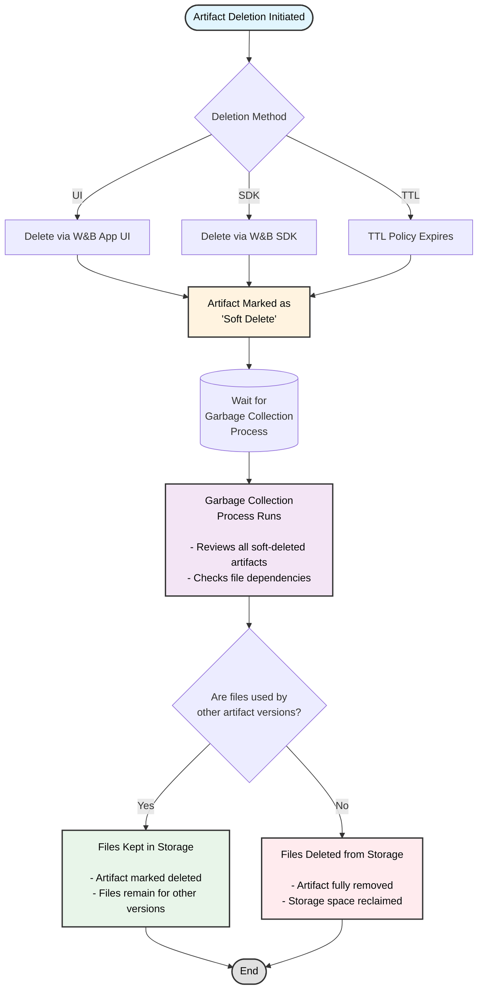

Delete artifacts interactively with the App UI or programmatically with the W&B SDK. When you delete an artifact, W&B marks that artifact as a *soft-delete*. In other words, the artifact is marked for deletion but files are not immediately deleted from storage. 

The contents of the artifact remain as a soft-delete, or pending deletion state, until a regularly run garbage collection process reviews all artifacts marked for deletion. The garbage collection process deletes associated files from storage if the artifact and its associated files are not used by a previous or subsequent artifact versions.

## Artifact garbage collection workflow

The following diagram illustrates the complete artifact garbage collection process:



The sections in this page describe how to delete specific artifact versions, how to delete an artifact collection, how to delete artifacts with and without aliases, and more. You can schedule when artifacts are deleted from W&B with TTL policies. For more information, see [Manage data retention with Artifact TTL policy](./ttl).

<Note>
Artifacts that are scheduled for deletion with a TTL policy, deleted with the W&B SDK, or deleted with the W&B App UI are first soft-deleted. Artifacts that are soft deleted undergo garbage collection before they are hard-deleted.
</Note>

<Note>
Deleting an entity, project, or artifact collection will also trigger the artifact deletion process described on this page. When deleting a run, if you choose to delete associated artifacts, those artifacts will follow the same soft-delete and garbage collection workflow.
</Note>

### Delete an artifact version

To delete an artifact version:

1. Select the name of the artifact. This will expand the artifact view and list all the artifact versions associated with that artifact.
2. From the list of artifacts, select the artifact version you want to delete.
3. On the right hand side of the workspace, select the kebab dropdown.
4. Choose Delete.

An artifact version can also be deleted programmatically via the [delete()](/ref/python/experiments/artifact.md#delete) method. See the examples below. 

### Delete multiple artifact versions with aliases

The following code example demonstrates how to delete artifacts that have aliases associated with them. Provide the entity, project name, and run ID that created the artifacts.

```python
import wandb

run = api.run("entity/project/run_id")

for artifact in run.logged_artifacts():
    artifact.delete()
```

Set the `delete_aliases` parameter to the boolean value, `True` to delete aliases if the artifact has one or more aliases.

```python
import wandb

run = api.run("entity/project/run_id")

for artifact in run.logged_artifacts():
    # Set delete_aliases=True in order to delete
    # artifacts with one more aliases
    artifact.delete(delete_aliases=True)
```

### Delete multiple artifact versions with a specific alias

The proceeding code demonstrates how to delete multiple artifact versions that have a specific alias. Provide the entity, project name, and run ID that created the artifacts. Replace the deletion logic with your own:

```python
import wandb

runs = api.run("entity/project_name/run_id")

# Delete artifact ith alias 'v3' and 'v4
for artifact_version in runs.logged_artifacts():
    # Replace with your own deletion logic.
    if artifact_version.name[-2:] == "v3" or artifact_version.name[-2:] == "v4":
        artifact.delete(delete_aliases=True)
```

### Protected aliases and deletion permissions

Artifacts with protected aliases have special deletion restrictions. [Protected aliases](/guides/registry/model_registry/access_controls/) are aliases in the Model Registry that registry admins can set to prevent unauthorized deletion.

<Note>
**Important considerations for protected aliases:**
- Artifacts with protected aliases cannot be deleted by non-registry admins
- Within a registry, registry admins can unlink protected artifact versions and delete collections/registries that contain protected aliases
- For source artifacts: if a source artifact is linked to a registry with a protected alias, it cannot be deleted by any user
- Registry admins can remove the protected aliases from source artifacts and then delete them
</Note>

### Delete all versions of an artifact that do not have an alias

The following code snippet demonstrates how to delete all versions of an artifact that do not have an alias. Provide the name of the project and entity for the `project` and `entity` keys in `wandb.Api`, respectively. Replace the `<>` with the name of your artifact:

```python
import wandb

# Provide your entity and a project name when you
# use wandb.Api methods.
api = wandb.Api(overrides={"project": "project", "entity": "entity"})

artifact_type, artifact_name = "<>"  # provide type and name
for v in api.artifact_versions(artifact_type, artifact_name):
    # Clean up versions that don't have an alias such as 'latest'.
    # NOTE: You can put whatever deletion logic you want here.
    if len(v.aliases) == 0:
        v.delete()
```

### Delete an artifact collection

To delete an artifact collection:

1. Navigate to the artifact collection you want to delete and hover over it.
3. Select the kebab dropdown next to the artifact collection name.
4. Choose Delete.

You can also delete artifact collection programmatically with the [delete()](/ref/python/experiments/artifact.md#delete) method. Provide the name of the project and entity for the `project` and `entity` keys in `wandb.Api`, respectively:

```python
import wandb

# Provide your entity and a project name when you
# use wandb.Api methods.
api = wandb.Api(overrides={"project": "project", "entity": "entity"})
collection = api.artifact_collection(
    "<artifact_type>", "entity/project/artifact_collection_name"
)
collection.delete()
```

## How to enable garbage collection based on how W&B is hosted
Garbage collection is enabled by default if you use W&B's shared cloud. Based on how you host W&B, you might need to take additional steps to enable garbage collection, this includes:


* Set the `GORILLA_ARTIFACT_GC_ENABLED` environment variable to true: `GORILLA_ARTIFACT_GC_ENABLED=true`
* Enable bucket versioning if you use [AWS](https://docs.aws.amazon.com/AmazonS3/latest/userguide/manage-versioning-examples.html), [GCP](https://cloud.google.com/storage/docs/object-versioning) or any other storage provider such as [Minio](https://min.io/docs/minio/linux/administration/object-management/object-versioning.html#enable-bucket-versioning). If you use Azure, [enable soft deletion](https://learn.microsoft.com/azure/storage/blobs/soft-delete-blob-overview).
    <Note>
    Soft deletion in Azure is equivalent to bucket versioning in other storage providers.
    </Note>

The following table describes how to satisfy requirements to enable garbage collection based on your deployment type. 

The `X` indicates you must satisfy the requirement:

|                                                | Environment variable    | Enable versioning | 
| -----------------------------------------------| ------------------------| ----------------- | 
| Shared cloud                                   |                         |                   | 
| Shared cloud with [secure storage connector](/guides/hosting/data-security/secure-storage-connector)|                         | X                 | 
| Dedicated cloud                                |                         |                   | 
| Dedicated cloud with [secure storage connector](/guides/hosting/data-security/secure-storage-connector)|                         | X                 | 
| Customer-managed cloud                         | X                       | X                 | 
| Customer managed on-prem                       | X                       | X                 |
 


<Note>
note
Secure storage connector is currently only available for Google Cloud Platform and Amazon Web Services.
</Note>