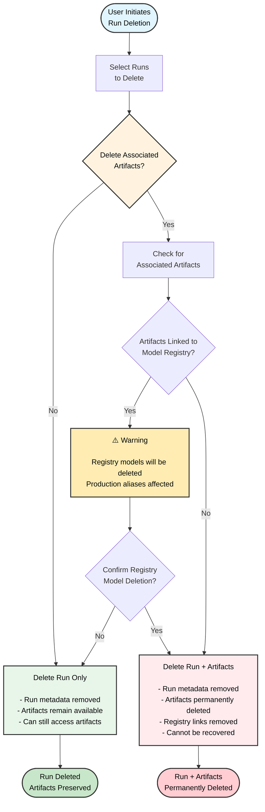

A *run* is a single unit of computation logged by W&B. You can think of a W&B Run as an atomic element of your whole project. In other words, each run is a record of a specific computation, such as training a model and logging the results, hyperparameter sweeps, and so forth.

Common patterns for initiating a run include, but are not limited to: 

* Training a model
* Changing a hyperparameter and conducting a new experiment
* Conducting a new machine learning experiment with a different model
* Logging data or a model as a [W&B Artifact](/guides/artifacts/)
* [Downloading a W&B Artifact](/guides/artifacts/download-and-use-an-artifact/)


W&B stores runs that you create into [*projects*](/guides/track/project-page/). You can view runs and their properties within the run's project workspace on the W&B App. You can also programmatically access run properties with the [`wandb.Api.Run`](/ref/python/experiments/run) object.

Anything you log with `wandb.Run.log()` is recorded in that run.

<Note>
Pass your W&B entity to the `entity` variable in the code snippets below if you want to follow along. Your entity is your W&B username or team name. You can find it in the URL of your W&B App workspace. For example, if your workspace URL is `https://wandb.ai/nico/awesome-project`, then your entity is `nico`.
</Note>

```python
import wandb

entity = "nico"  # Replace with your W&B entity
project = "awesome-project"

with wandb.init(entity=entity, project=project) as run:
    run.log({"accuracy": 0.9, "loss": 0.1})
```

The first line imports the W&B Python SDK. The second line initializes a run in the project `awesome-project` under the entity `nico`. The third line logs the accuracy and loss of the model to that run.

Within the terminal, W&B returns:

```bash
wandb: Syncing run earnest-sunset-1
wandb: ⭐️ View project at https://wandb.ai/nico/awesome-project
wandb: 🚀 View run at https://wandb.ai/nico/awesome-project/runs/1jx1ud12
wandb:                                                                                
wandb: 
wandb: Run history:
wandb: accuracy ▁
wandb:     loss ▁
wandb: 
wandb: Run summary:
wandb: accuracy 0.9
wandb:     loss 0.5
wandb: 
wandb: 🚀 View run earnest-sunset-1 at: https://wandb.ai/nico/awesome-project/runs/1jx1ud12
wandb: ⭐️ View project at: https://wandb.ai/nico/awesome-project
wandb: Synced 6 W&B file(s), 0 media file(s), 0 artifact file(s) and 0 other file(s)
wandb: Find logs at: ./wandb/run-20241105_111006-1jx1ud12/logs
```

The URL W&B returns in the terminal to redirects you to the run's workspace in the W&B App UI. Note that the panels generated in the workspace corresponds to the single point.

<Frame>
    
</Frame>

Logging a metrics at a single point of time might not be that useful. A more realistic example in the case of training discriminative models is to log metrics at regular intervals. For example, consider the proceeding code snippet:

```python
import wandb
import random

config = {
    "epochs": 10,
    "learning_rate": 0.01,
}

with wandb.init(project="awesome-project", config=config) as run:
    print(f"lr: {config['learning_rate']}")
      
    # Simulating a training run
    for epoch in range(config['epochs']):
      offset = random.random() / 5
      acc = 1 - 2**-epoch - random.random() / (epoch + 1) - offset
      loss = 2**-epoch + random.random() / (epoch + 1) + offset
      print(f"epoch={epoch}, accuracy={acc}, loss={loss}")
      run.log({"accuracy": acc, "loss": loss})
```

This returns the following output:

```bash
wandb: Syncing run jolly-haze-4
wandb: ⭐️ View project at https://wandb.ai/nico/awesome-project
wandb: 🚀 View run at https://wandb.ai/nico/awesome-project/runs/pdo5110r
lr: 0.01
epoch=0, accuracy=-0.10070974957523078, loss=1.985328507123956
epoch=1, accuracy=0.2884687745057535, loss=0.7374362314407752
epoch=2, accuracy=0.7347387967382066, loss=0.4402409835486663
epoch=3, accuracy=0.7667969248039795, loss=0.26176963846423457
epoch=4, accuracy=0.7446848791003173, loss=0.24808611724405083
epoch=5, accuracy=0.8035095836268268, loss=0.16169791827329466
epoch=6, accuracy=0.861349032371624, loss=0.03432578493587426
epoch=7, accuracy=0.8794926436276016, loss=0.10331872172219471
epoch=8, accuracy=0.9424839917077272, loss=0.07767793473500445
epoch=9, accuracy=0.9584880427028566, loss=0.10531971149250456
wandb: 🚀 View run jolly-haze-4 at: https://wandb.ai/nico/awesome-project/runs/pdo5110r
wandb: Find logs at: wandb/run-20241105_111816-pdo5110r/logs
```

The training script calls `wandb.Run.log()` 10 times. Each time the script calls `wandb.Run.log()`, W&B logs the accuracy and loss for that epoch. Selecting the URL that W&B prints from the preceding output, directs you to the run's workspace in the W&B App UI.

W&B captures the simulated training loop within a single run called `jolly-haze-4`. This is because the script calls `wandb.init()` method only once. 

<Frame>
    
</Frame>

As another example, during a [sweep](/guides/sweeps/), W&B explores a hyperparameter search space that you specify. W&B implements each new hyperparameter combination that the sweep creates as a unique run.


## Initialize a W&B Run

Initialize a W&B Run with [`wandb.init()`](/ref/python/functions/init). The proceeding code snippet shows how to import the W&B Python SDK and initialize a run. 

Ensure to replace values enclosed in angle brackets (`< >`) with your own values:

```python
import wandb

with wandb.init(entity="<entity>", project="<project>") as run:
    # Your code here
```

When you initialize a run, W&B logs your run to the project you specify for the project field (`wandb.init(project="<project>"`). W&B creates a new project if the project does not already exist. If the project already exists, W&B stores the run in that project.

<Note>
If you do not specify a project name, W&B stores the run in a project called `Uncategorized`.
</Note>

Each run in W&B has a [unique identifier known as a *run ID*](#unique-run-identifiers). [You can specify a unique ID](#unique-run-identifiers) or let [W&B randomly generate one for you](#autogenerated-run-ids).

Each run also has a human-readable, non-unique [run name](#name-your-run). You can specify a name for your run or let W&B randomly generate one for you. You can rename a run after initializing it.

For example, consider the following code snippet:

```python title="basic.py"
import wandb

run = wandb.init(entity="wandbee", project="awesome-project")
```
The code snippet produces the following output:

```bash
🚀 View run exalted-darkness-6 at: 
https://wandb.ai/nico/awesome-project/runs/pgbn9y21
Find logs at: wandb/run-20241106_090747-pgbn9y21/logs
```

Since the preceding code did not specify an argument for the id parameter, W&B creates a unique run ID. Where `nico` is the entity that logged the run, `awesome-project` is the name of the project the run is logged to, `exalted-darkness-6` is the name of the run, and `pgbn9y21` is the run ID.

<Note>
**Notebook users**

Specify `run.finish()` at the end of your run to mark the run finished. This helps ensure that the run is properly logged to your project and does not continue in the background.

```python title="notebook.ipynb"
import wandb

run = wandb.init(entity="<entity>", project="<project>")
# Training code, logging, and so forth
run.finish()
```
</Note>

If you [group runs](/guides/runs/grouping/) into experiments, you can move a run into or out of a group or from one group to another.

Each run has a state that describes the current status of the run. See [Run states](#run-states) for a full list of possible run states.

## Run states
The proceeding table describes the possible states a run can be in: 

| State | Description |
| ----- | ----- |
| `Crashed` | Run stopped sending heartbeats in the internal process, which can happen if the machine crashes. | 
| `Failed` | Run ended with a non-zero exit status. | 
| `Finished`| Run ended and fully synced data, or called `wandb.Run.finish()`. |
| `Killed` | Run was forcibly stopped before it could finish. |
| `Running` | Run is still running and has recently sent a heartbeat.  |
| `Pending` | Run is scheduled but not yet started (common in sweeps and Launch jobs). |

### Run states in sweeps

When runs are part of a [sweep](/guides/models/sweeps/), their states behave independently from the sweep's status:

- **Individual run states** reflect each run's execution status (Running, Finished, Failed, etc.)
- **Sweep status** controls whether new runs are created, not how existing runs execute
- Pausing or stopping a sweep doesn't affect already-running runs
- Only cancelling a sweep forcibly kills running runs (changes their state to `Killed`)

For a detailed explanation of how sweep and run statuses interact, see [Understanding sweep and run statuses](/guides/models/sweeps/pause-resume-and-cancel-sweeps#understanding-sweep-and-run-statuses).

## Unique run identifiers

Run IDs are unique identifiers for runs. By default, [W&B generates a random and unique run ID for you](#autogenerated-run-ids) when you initialize a new run. You can also [specify your own unique run ID](#custom-run-ids) when you initialize a run. 

### Autogenerated run IDs

If you do not specify a run ID when you initialize a run, W&B generates a random run ID for you. You can find the unique ID of a run in the W&B App.

1. Navigate to the [W&B App](https://wandb.ai/home).
2. Navigate to the W&B project you specified when you initialized the run.
3. Within your project's workspace, select the **Runs** tab.
4. Select the **Overview** tab.

W&B displays the unique run ID in the **Run path** field. The run path consists of the name of your team, the name of the project, and the run ID. The unique ID is the last part of the run path.

For example, in the proceeding image, the unique run ID is `9mxi1arc`:

<Frame>
    
</Frame>


### Custom run IDs
You can specify your own run ID by passing the `id` parameter to the [`wandb.init()`](/ref/python/functions/init) method. 

```python 
import wandb

run = wandb.init(entity="<project>", project="<project>", id="<run-id>")
```

You can use a run's unique ID to directly navigate to the run's overview page in the W&B App. The proceeding cell shows the URL path for a specific run:

```text title="W&B App URL for a specific run"
https://wandb.ai/<entity>/<project>/<run-id>
```

Where values enclosed in angle brackets (`< >`) are placeholders for the actual values of the entity, project, and run ID.

## Name your run 
The name of a run is a human-readable, non-unique identifier. 

By default, W&B generates a random run name when you initialize a new run. The name of a run appears within your project's workspace and at the top of the [run's overview page](#overview-tab).

<Note>
Use run names as a way to quickly identify a run in your project workspace.
</Note>

You can specify a name for your run by passing the `name` parameter to the [`wandb.init()`](/ref/python/functions/init) method. 


```python 
import wandb

with wandb.init(entity="<project>", project="<project>", name="<run-name>") as run:
    # Your code here
```

### Rename a run

After you initialize a run, you can rename it from your workspace or its **Runs** page.

1. Navigate to your W&B project.
1. Select the **Workspace** or **Runs** tab from the project sidebar.
1. Search or scroll to the run you want to rename.

    Hover over the run name, click the three vertical dots, then select the scope:
    - **Rename run for project**: The run is renamed across the project.
    - **Rename run for workspace**: The run is renamed only in this workspace.
1. Type a new name for the run. To generate a new random name, leave the field blank.
1. Submit the form. The run's new name displays. An information icon appears next to a run that has a custom name in the workspace. Hover over it for more details.

You can also rename a run from a run set in a [report](/guides/reports/edit-a-report/):

1. In the report, click the pencil icon to open the report editor.
1. In the run set, find the run to rename. Hover over the report name, click the three vertical dots, then select either:

  - **Rename run for project**: rename the run across the entire project. To generate a new random name, leave the field blank.
  - **Rename run for panel grid** rename the run only in the report, preserving the existing name in other contexts. Generating a new random name is not supported.

  Submit the form.
1. Click **Publish report**.

## Add a note to a run
Notes that you add to a specific run appear on the run page in the **Overview** tab and in the table of runs on the project page.

1. Navigate to your W&B project
2. Select the **Workspace** tab from the project sidebar
3. Select the run you want to add a note to from the run selector
4. Choose the **Overview** tab
5. Select the pencil icon next to the **Description** field and add your notes

## Stop a run
Stop a run from the W&B App or programmatically.

<Tabs>
<Tab title="Programmatically">
1. Navigate to the terminal or code editor where you initialized the run.
2. Press `Ctrl+D` to stop the run.

For example, following the preceding instructions, your terminal might looks similar to the following: 

```bash
KeyboardInterrupt
wandb: 🚀 View run legendary-meadow-2 at: https://wandb.ai/nico/history-blaster-4/runs/o8sdbztv
wandb: Synced 5 W&B file(s), 0 media file(s), 0 artifact file(s) and 1 other file(s)
wandb: Find logs at: ./wandb/run-20241106_095857-o8sdbztv/logs
```

Navigate to the W&B App to confirm the run is no longer active:

1. Navigate to the project that your run was logging to.
2. Select the name of the run. 
  <Note>
You can find the name of the run that you stop from the output of your terminal or code editor. For example, in the preceding example, the name of the run is `legendary-meadow-2`.
</Note>
3. Choose the **Overview** tab from the project sidebar.

Next to the **State** field, the run's state changes from `running` to `Killed`.

<Frame>
    
</Frame>
</Tab>
<Tab title="W&B App">
1. Navigate to the project that your run is logging to.
2. Select the run you want to stop within the run selector.
3. Choose the **Overview** tab from the project sidebar.
4. Select the top button next to the **State** field.
<Frame>
    
</Frame>

Next to the **State** field, the run's state changes from `running` to `Killed`.

<Frame>
    
</Frame>
</Tab>
</Tabs>

See [State fields](#run-states) for a full list of possible run states.

## View logged runs

View a information about a specific run such as the state of the run, artifacts logged to the run, log files recorded during the run, and more. 

<Frame>
    
</Frame>

To view a specific run:

1. Navigate to the [W&B App](https://wandb.ai/home).
2. Navigate to the W&B project you specified when you initialized the run.
3. Within the project sidebar, select the **Workspace** tab.
4. Within the run selector, click the run you want to view, or enter a partial run name to filter for matching runs.

Note that the URL path of a specific run has the proceeding format:

```text
https://wandb.ai/<team-name>/<project-name>/runs/<run-id>
```

Where values enclosed in angle brackets (`< >`) are placeholders for the actual values of the team name, project name, and run ID.

### Customize how runs are displayed
This section shows how to customize how runs are displayed in your project's workspace and runs table.

<Note>
A workspace is limited to displaying a maximum of 1000 runs, regardless of its configuration.
</Note>

#### Add or remove columns

To customize which columns are visible in the Runs table or Workspace:
1. In the project sidebar, select either the **Runs** tab or the **Workspace** tab.
1. Above the list of runs, click **Columns**.
1. Click the name of a hidden column to show it. Click the name of a visible column to hide it.
    You can optionally search by column name using fuzzy search, an exact match, or regular expressions. Drag columns to change their order.
1. Click **Done** to close the column browser.

#### Sort runs by column

To sort the list of runs by any visible column:

1. Hover over the column name, then click its action `...` menu.
1. Click **Sort ascending** or **Sort descending**.

#### Pin columns

Pinned columns are shown on the left-hand side. Unpinned columns are shown on the right-hand side of the **Runs** tab and are not shown on the **Workspace** tab.

To pin a column:
1. In the project sidebar, navigate to the **Runs** tab.
1. Click **Pin column**.

To unpin a column:
1. In the project sidebar, navigate to the **Workspace** or **Runs** tab.
1. Hover over the column name, then click its action `...` menu.
1. Click **Unpin column**.

#### Customize run name truncation

By default, long run names are truncated in the middle for readability. To customize the truncation of run names:

1. Click the action `...` menu at the top of the list of runs.
1. Set **Run name cropping** to crop the end, middle, or beginning.

### Overview tab
Use the **Overview** tab to learn about specific run information in a project, such as:

* **Author**: The W&B entity that creates the run.
* **Command**: The command that initializes the run.
* **Description**: A description of the run that you provided. This field is empty if you do not specify a description when you create the run. You can add a description to a run with the W&B App UI or programmatically with the Python SDK.
* **Tracked Hours**: The amount of time the run is actively computing or logging data, excluding any pauses or waiting periods. This metric helps you understand the actual computational time spent on your run.
* **Runtime**: Measures the total time from the start to the end of the run. It's the wall-clock time for the run, including any time where the run is paused or waiting for resources. This metric provides the complete elapsed time for your run.
* **Git repository**: The git repository associated with the run. You must [enable git](/guides/app/settings-page/user-settings/#personal-github-integration) to view this field.
* **Host name**: Where W&B computes the run. W&B displays the name of your machine if you initialize the run locally on your machine.
* **Name**: The name of the run.
* **OS**: Operating system that initializes the run.
* **Python executable**: The command that starts the run.
* **Python version**: Specifies the Python version that creates the run.
* **Run path**: Identifies the unique run identifier in the form `entity/project/run-ID`.
* **Start time**: The timestamp when you initialize the run.
* **State**: The [state of the run](#run-states).
* **System hardware**: The hardware W&B uses to compute the run.
* **Tags**: A list of strings. Tags are useful for organizing related runs together or applying temporary labels like `baseline` or `production`.
* **W&B CLI version**: The W&B CLI version installed on the machine that hosted the run command.
* **Git state**: The most recent git commit SHA of a repository or working directory where the run is initialized. This field is empty if you do not enable Git when you create the run or if the git information is not available.

W&B stores the proceeding information below the overview section:

* **Artifact Outputs**: Artifact outputs produced by the run.
* **Config**: List of config parameters saved with [`wandb.Run.config`](/guides/track/config/).
* **Summary**: List of summary parameters saved with [`wandb.Run.log()`](/guides/track/log/). By default, W&B sets this value to the last value logged.

<Frame>
    
</Frame>

View an example project overview [here](https://wandb.ai/stacey/deep-drive/overview).

### Workspace tab
Use the Workspace tab to view, search, group, and arrange visualizations such as autogenerated and custom plots, system metrics, and more. 

<Frame>
    
</Frame>

View an example project workspace [here](https://wandb.ai/stacey/deep-drive/workspace?nw=nwuserstacey)

### Runs tab
{/* Keep this in sync with /guide/models/track/project-page.md */}
Use the Runs tab to filter, group, and sort your runs.

<Frame>
    
</Frame>

{/* [Try these yourself →](https://wandb.ai/stacey/mnist-viz/artifacts/predictions/baseline/d888bc05719667811b23/files/predictions.table.json) */}


The proceeding tabs demonstrate some common actions you can take in the Runs tab.

<Tabs>
<Tab title="Customize columns">
The Runs tab shows details about runs in the project. It shows a large number of columns by default.

- To view all visible columns, scroll the page horizontally.
- To change the order of the columns, drag a column to the left or right.
- To pin a column, hover over the column name, click the action menu `...`. that appears, then click **Pin column**. Pinned columns appear near the left of the page, after the **Name** column. To unpin a pinned column, choose **Unpin column**
- To hide a column, hover over the column name, click the action menu `...`. that appears, then click **Hide column**. To view all columns that are currently hidden, click **Columns**.
- To show, hide, pin, and unpin multiple columns at once, click **Columns**.
  - Click the name of a hidden column to unhide it.
  - Click the name of a visible column to hide it.
  - Click the pin icon next to a visible column to pin it.

When you customize the Runs tab, the customization is also reflected in the **Runs** selector of the [Workspace tab](#workspace-tab).
</Tab>
<Tab title="Sort">
Sort all rows in a Table by the value in a given column. 

1. Hover your mouse over the column title. A kebab menu will appear (three vertical docs).
2. Select on the kebab menu (three vertical dots).
3. Choose **Sort Asc** or **Sort Desc** to sort the rows in ascending or descending order, respectively. 

<Frame>
    
</Frame>

The preceding image demonstrates how to view sorting options for a Table column called `val_acc`.
</Tab>
<Tab title="Filter">
Filter all rows by an expression with the **Filter** button above the dashboard. 

<Frame>
    
</Frame>

Select **Add filter** to add one or more filters to your rows. Three dropdown menus will appear. From left to right the filter types are based on: Column name, Operator , and Values

|                   | Column name | Binary relation    | Value       |
| -----------       | ----------- | ----------- | ----------- |
| Accepted values   | String       |  &equals;, &ne;, &le;, &ge;, IN, NOT IN,  | Integer, float, string, timestamp, null |


The expression editor shows a list of options for each term using autocomplete on column names and logical predicate structure. You can connect multiple logical predicates into one expression using "and" or "or" (and sometimes parentheses).

<Frame>
    
</Frame>
The preceding image shows a filter that is based on the `val_loss` column. The filter shows runs with a validation loss less than or equal to 1.
</Tab>
<Tab title="Group">
Group all rows by the value in a particular column with the **Group by** button above the dashboard. 

<Frame>
    
</Frame>

By default, this turns other numeric columns into histograms that each show the distribution of values for that column across the group. Grouping is helpful for understanding higher-level patterns in your data. 

<Note>
The **Group by** feature is distinct from a [run's run group](/guides/runs/grouping/). You can group runs by run group. To move a run to a different run group, refer to [Assign a group or job type to a run](#assign-a-group-or-job-type-to-a-run).
</Note>
</Tab>
</Tabs>

### Logs tab
The **Log tab** shows output printed on the command line such as the standard output (`stdout`) and standard error (`stderr`). 

Choose the **Download** button in the upper right hand corner to download the log file.

<Frame>
    
</Frame>

View an example logs tab [here](https://app.wandb.ai/stacey/deep-drive/runs/pr0os44x/logs).

### Files tab
Use the **Files tab** to view files associated with a specific run such as model checkpoints, validation set examples, and more

<Frame>
    
</Frame>

View an example files tab [here](https://app.wandb.ai/stacey/deep-drive/runs/pr0os44x/files/media/images).

### Artifacts tab
The **Artifacts** tab lists the input and output [artifacts](/guides/artifacts/) for the specified run.

<Frame>
    
</Frame>

View [example artifact graphs](/guides/artifacts/explore-and-traverse-an-artifact-graph/).

## Delete runs

Delete one or more runs from a project with the W&B App.

1. Navigate to the project that contains the runs you want to delete.
2. Select the **Runs** tab from the project sidebar.
3. Select the checkbox next to the runs you want to delete.
4. Choose the **Delete** button (trash can icon) above the table.
5. From the modal that appears, choose **Delete**.

<Note>
Once a run with a specific ID is deleted, its ID may not be used again. Trying to initiate a run with a previously deleted ID will show an error and prevent initiation.
</Note>

<Note>
For projects that contain a large number of runs, you can use either the search bar to filter runs you want to delete using Regex or the filter button to filter runs based on their status, tags, or other properties.
</Note>

### Run deletion workflow

The following diagram illustrates the complete run deletion process, including the handling of associated artifacts and Model Registry links:



<Note>
**Important**

When you delete a run and choose to delete associated artifacts, the artifacts are permanently removed and can't be recovered, even if the run is restored later. This includes models linked to the Model Registry.
</Note>

## Organize runs 

This section provides instructions on how to organize runs using groups and job types. By assigning runs to groups (for example, experiment names) and specifying job types (for example, preprocessing, training, evaluation, debugging), you can streamline your workflow and improve model comparison.

### Assign a group or job type to a run

Each run in W&B can be categorized by **group** and a **job type**:

- **Group**: a broad category for the experiment, used to organize and filter runs.
- **Job type**: the function of the run, such as `preprocessing`, `training`, or `evaluation`.

The proceeding [example workspace](https://wandb.ai/stacey/model_iterz?workspace=user-stacey), trains a baseline model using increasing amounts of data from the Fashion-MNIST dataset. The workspace uses colors to represent the amount of data used:

- **Yellow to dark green** indicate increasing amounts of data for the baseline model.
- **Light blue to violet to magenta** indicate amounts of data for a more complex "double" model with additional parameters.

Use W&B's filtering options and search bar to compare runs based on specific conditions, such as:
- Training on the same dataset.
- Evaluating on the same test set.

When you apply filters, the **Table** view is updated automatically. This allows you to identify performance differences between models, such as determining which classes are significantly more challenging for one model compared to another.

{/* ### Search runs

Search for a specific run by name in the sidebar. You can use regex to filter down your visible runs. The search box affects which runs are shown on the graph. Here's an example:

### Filter runs

### Organize runs */}
