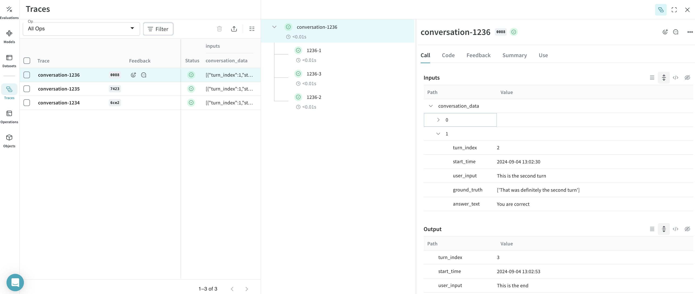
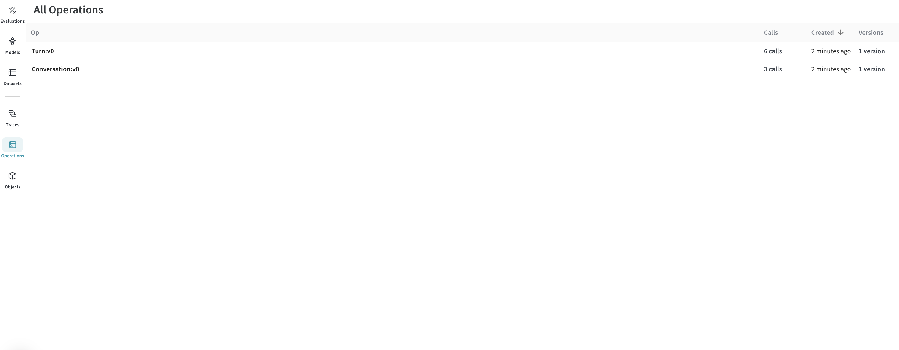
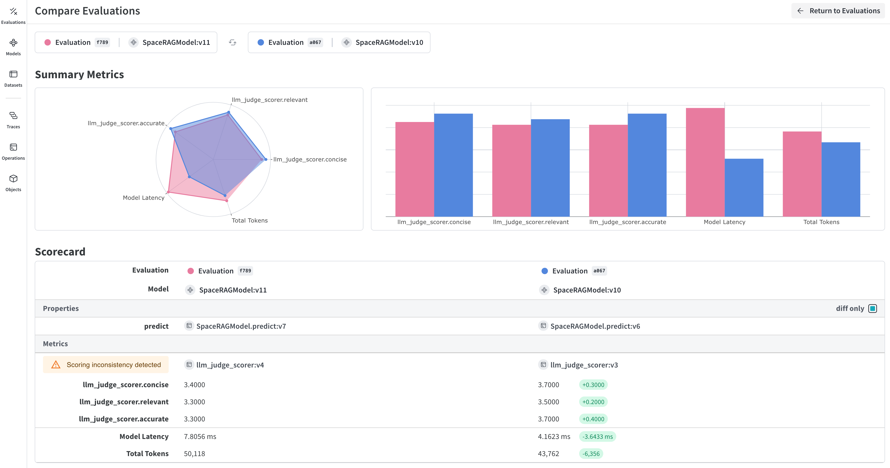
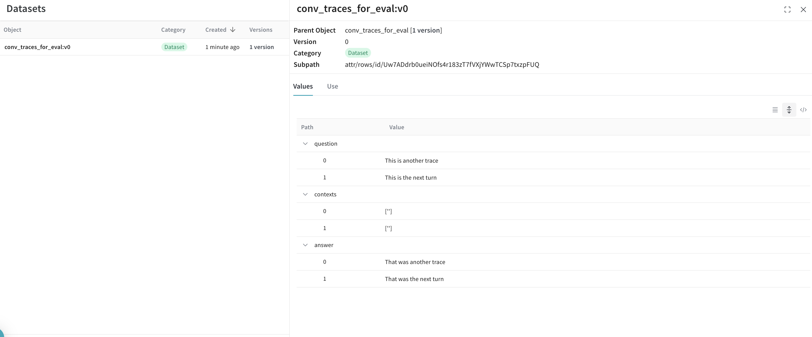

<Note>
  これはインタラクティブなノートブックです。ローカルで実行するか、以下のリンクを使用できます：

  * [Google Colabで開く](https://colab.research.google.com/github/wandb/weave/blob/master/docs/notebooks/import_from_csv.ipynb)
  * [GitHubでソースを表示](https://github.com/wandb/weave/blob/master/docs/notebooks/import_from_csv.ipynb)
</Note>

# サードパーティシステムからのトレースのインポート

場合によっては、Weaveの簡単な統合を使用してPythonやJavascriptコードを計測し、GenAIアプリケーションのリアルタイムトレースを取得することができないことがあります。多くの場合、これらのトレースは後で`csv`または`json`形式で利用可能になります。

このクックブックでは、より低レベルのWeave Python APIを探索して、CSVファイルからデータを抽出し、Weaveにインポートして洞察と厳密な評価を行います。

このクックブックで想定されているサンプルデータセットは、以下の構造を持っています：

```
conversation_id,turn_index,start_time,user_input,ground_truth,answer_text
1234,1,2024-09-04 13:05:39,This is the beginning, ['This was the beginning'], That was the beginning
1235,1,2024-09-04 13:02:11,This is another trace,, That was another trace
1235,2,2024-09-04 13:04:19,This is the next turn,, That was the next turn
1236,1,2024-09-04 13:02:10,This is a 3 turn conversation,, Woah thats a lot of turns
1236,2,2024-09-04 13:02:30,This is the second turn, ['That was definitely the second turn'], You are correct
1236,3,2024-09-04 13:02:53,This is the end,, Well good riddance!

```

このクックブックでのインポートの決定を理解するには、Weaveトレースには1対多の継続的な親子関係があることを知っておく必要があります。つまり、1つの親は複数の子を持つことができますが、その親自体が別の親の子である可能性もあります。

したがって、私たちは`conversation_id`を親識別子として、`turn_index`を子識別子として使用し、完全な会話ログを提供します。

必要に応じて変数を変更してください。

# 環境のセットアップ

必要なパッケージをすべてインストールしてインポートします。
環境に`WANDB_API_KEY`を設定して、`wandb.login()`で簡単にログインできるようにします（これはcolabに秘密として与えられるべきです）。

colabにアップロードするファイルの名前を`name_of_file`に設定し、これをログに記録したいW\&Bのプロジェクトを`name_of_wandb_project`に設定します。

***NOTE:*** `name_of_wandb_project`は`{team_name}/{project_name}`の形式でもよく、トレースをログに記録するチームを指定します。

次に、`weave.init()`

```python
%pip install wandb weave pandas datetime --quiet
python
import os

import pandas as pd
import wandb
from google.colab import userdata

import weave

## Write samples file to disk
with open("/content/import_cookbook_data.csv", "w") as f:
    f.write(
        "conversation_id,turn_index,start_time,user_input,ground_truth,answer_text\n"
    )
    f.write(
        '1234,1,2024-09-04 13:05:39,This is the beginning, ["This was the beginning"], That was the beginning\n'
    )
    f.write(
        "1235,1,2024-09-04 13:02:11,This is another trace,, That was another trace\n"
    )
    f.write(
        "1235,2,2024-09-04 13:04:19,This is the next turn,, That was the next turn\n"
    )
    f.write(
        "1236,1,2024-09-04 13:02:10,This is a 3 turn conversation,, Woah thats a lot of turns\n"
    )
    f.write(
        '1236,2,2024-09-04 13:02:30,This is the second turn, ["That was definitely the second turn"], You are correct\n'
    )
    f.write("1236,3,2024-09-04 13:02:53,This is the end,, Well good riddance!\n")

os.environ["WANDB_API_KEY"] = userdata.get("WANDB_API_KEY")
name_of_file = "/content/import_cookbook_data.csv"
name_of_wandb_project = "import-weave-traces-cookbook"

wandb.login()
python
weave_client = weave.init(name_of_wandb_project)
```

# データの読み込み

データをPandasデータフレームに読み込み、`conversation_id`と`turn_index`で並べ替えて、親と子が正しく順序付けられていることを確認します。

これにより、会話のターンが`conversation_data`の下に配列として含まれる2列のpandas DFが生成されます。

```python
## Load data and shape it
df = pd.read_csv(name_of_file)

sorted_df = df.sort_values(["conversation_id", "turn_index"])

# Function to create an array of dictionaries for each conversation
def create_conversation_dict_array(group):
    return group.drop("conversation_id", axis=1).to_dict("records")

# Group the dataframe by conversation_id and apply the aggregation
result_df = (
    sorted_df.groupby("conversation_id")
    .apply(create_conversation_dict_array)
    .reset_index()
)
result_df.columns = ["conversation_id", "conversation_data"]

# Show how our aggregation looks
result_df.head()
```

# トレースをWeaveにログ記録する

ここでpandas DFを反復処理します：

* すべての`conversation_id`
* ターン配列を反復処理して、`turn_index`

低レベルPython APIの重要な概念：

* Weave callはWeaveトレースと同等であり、このcallには関連する親または子がある場合があります
* Weave callには他のものも関連付けることができます：フィードバック、メタデータなど。ここでは入力と出力のみを関連付けていますが、データが提供する場合は、インポート時にこれらのものを追加することもできます。
* weave callは`created`および`finished`されます。これらはリアルタイムで追跡されることを意図しています。これは事後のインポートであるため、オブジェクトが定義され互いに結び付けられたら、作成して終了します。
* callの`op`値は、Weaveが同じ構成のcallをどのように分類するかです。この例では、すべての親callは`Conversation`タイプで、すべての子callは`Turn`タイプです。これは必要に応じて変更できます。
* callには`inputs`と`output`があります。`inputs`は作成時に定義され、`output`はcallが終了したときに定義されます。

```python
# Log traces to weave

# Iterate through our aggregated conversations
for _, row in result_df.iterrows():
    # Define our conversation parent,
    # we are now creating a "call" with the weave_client we defined before
    parent_call = weave_client.create_call(
        # The Op value will register this as a Weave Op, which will allow us to retrieve these as a group easily in the future
        op="Conversation",
        # We set the inputs of our high level conversation as all the turns under it
        inputs={
            "conversation_data": row["conversation_data"][:-1]
            if len(row["conversation_data"]) > 1
            else row["conversation_data"]
        },
        # Our Conversation parent does not have a further parent
        parent=None,
        # The name of how this specific conversation will appear in the UI
        display_name=f"conversation-{row['conversation_id']}",
    )

    # We set the output of the parent to be the last trace in the conversation
    parent_output = row["conversation_data"][len(row["conversation_data"]) - 1]

    # We now iterate through all the conversation turns for the parent
    # and log them as children of the conversation
    for item in row["conversation_data"]:
        item_id = f"{row['conversation_id']}-{item['turn_index']}"

        # We create a call again here to be categorized under the conversation
        call = weave_client.create_call(
            # We qualify a single conversation trace as a "Turn"
            op="Turn",
            # We provide all inputs of the turn, including RAG 'ground_truth'
            inputs={
                "turn_index": item["turn_index"],
                "start_time": item["start_time"],
                "user_input": item["user_input"],
                "ground_truth": item["ground_truth"],
            },
            # We set this to be a child of the parent we defined
            parent=parent_call,
            # We provide it a name to be id'ed by in Weave
            display_name=item_id,
        )

        # We set the output of the call as the answer
        output = {
            "answer_text": item["answer_text"],
        }

        # Because these are traces that already happened, we finish the single turn call
        weave_client.finish_call(call=call, output=output)
    # Now that we have logged all its children, we also finish the parent call
    weave_client.finish_call(call=parent_call, output=parent_output)
```

# Result: Traces are Logged to Weave

Traces:



Operations:



# Bonus: Export your traces to run rigorous evaluations!

トレースがWeaveに入り、会話がどのように見えるかを理解したら、後でそれらを別のプロセスにエクスポートしてWeave Evaluationsを実行したい場合があります



これを行うには、シンプルなクエリAPIを通じてW\&Bからすべての会話を取得し、そこからデータセットを作成します。

```python
## This cell does not run by default, comment the below line to execute this script
%%script false --no-raise-error
## Get all Conversation traces for evaluation and prepare dataset for eval

# We create a query filter that brings us all our Conversation objects
# The ref shown below is specific to your project, and you can obtain it by
# going into your project's Operations in the UI, clicking on the "Conversations"
# object, then the "Use" tab in the side panel.
weave_ref_for_conversation_op = "weave:///wandb-smle/import-weave-traces-cookbook/op/Conversation:tzUhDyzVm5bqQsuqh5RT4axEXSosyLIYZn9zbRyenaw"
filter = weave.trace_server.trace_server_interface.CallsFilter(
    op_names=[weave_ref_for_conversation_op],
  )

# We execute the query
conversation_traces = weave_client.get_calls(filter=filter)

rows = []

# We go through our conversation traces and construct dataset rows from it
for single_conv in conversation_traces:
  # In this example, we may only care for conversations that utilized our RAG
  # pipeline, so we filter for such types of conversations
  is_rag = False
  for single_trace in single_conv.inputs['conversation_data']:
    if single_trace['ground_truth'] is not None:
      is_rag = True
      break
  if single_conv.output['ground_truth'] is not None:
      is_rag = True

  # Once we've identified a converation to have used RAG, we add it to our dataset
  if is_rag:
    inputs = []
    ground_truths = []
    answers = []

    # We go through every turn in the conversation
    for turn in single_conv.inputs['conversation_data']:
      inputs.append(turn.get('user_input', ''))
      ground_truths.append(turn.get('ground_truth', ''))
      answers.append(turn.get('answer_text', ''))
    ## Account for when conversations are a single turn
    if len(single_conv.inputs) != 1 or single_conv.inputs['conversation_data'][0].get('turn_index') != single_conv.output.get('turn_index'):
      inputs.append(single_conv.output.get('user_input', ''))
      ground_truths.append(single_conv.output.get('ground_truth', ''))
      answers.append(single_conv.output.get('answer_text', ''))

    data = {
        'question': inputs,
        'contexts': ground_truths,
        'answer': answers
    }

    rows.append(data)

# With our dataset rows created, we create the Dataset object and
# publish it back to Weave for later retrieval
dset = weave.Dataset(name = "conv_traces_for_eval", rows=rows)
weave.publish(dset)
```

# 結果



評価についてもっと学ぶには、[クイックスタート](https://weave-docs.wandb.ai/tutorial-rag)をチェックして、新しく作成したデータセットを使用してRAGアプリケーションを評価しましょう！
