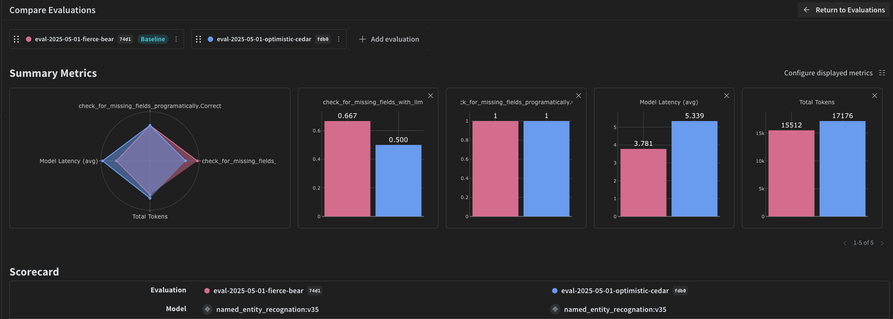

<Note>
  これはインタラクティブなノートブックです。ローカルで実行するか、以下のリンクを使用してください：

  * [Google Colabで開く](https://colab.research.google.com/github/wandb/weave/blob/master/docs/notebooks/ocr-pipeline.ipynb)
  * [GitHubでソースを表示](https://github.com/wandb/weave/blob/master/docs/notebooks/ocr-pipeline.ipynb)
</Note>

## 前提条件

始める前に、必要なライブラリをインストールしてインポートし、W\&B APIキーを取得して、Weaveプロジェクトを初期化してください。

```python
# Install the required dependencies
!pip install openai weave -q
python
import json
import os

from google.colab import userdata
from openai import OpenAI

import weave
python
# Get API Keys
os.environ["OPENAI_API_KEY"] = userdata.get(
    "OPENAI_API_KEY"
)  # please set the keys as collab environment secrets from the menu on the left
os.environ["WANDB_API_KEY"] = userdata.get("WANDB_API_KEY")

# Set project name
# Replace the PROJECT value with your project name
PROJECT = "vlm-handwritten-ner"

# Initiatlize the Weave project
weave.init(PROJECT)
```

## 1. Weaveでプロンプトを作成し改良する

適切なプロンプトエンジニアリングは、モデルが適切にエンティティを抽出するよう導くために非常に重要です。まず、画像データから何を抽出し、どのようにフォーマットするかについての指示をモデルに与える基本的なプロンプトを作成します。次に、追跡と反復のためにWeaveにプロンプトを保存します。

````python
# Create your prompt object with Weave
prompt = """
Extract all readable text from this image. Format the extracted entities as a valid JSON.
Do not return any extra text, just the JSON. Do not include ```json```
Use the following format:
{"Patient Name": "James James","Date": "4/22/2025","Patient ID": "ZZZZZZZ123","Group Number": "3452542525"}
"""
system_prompt = weave.StringPrompt(prompt)
# Publish your prompt to Weave
weave.publish(system_prompt, name="NER-prompt")
````

次に、より多くの指示と検証ルールを追加してプロンプトを改善し、出力のエラーを減らすのに役立てます。

````python
better_prompt = """
You are a precision OCR assistant. Given an image of patient information, extract exactly these fields into a single JSON object—and nothing else:

- Patient Name
- Date (MM/DD/YYYY)
- Patient ID
- Group Number

Validation rules:
1. Date must match MM/DD/YY; if not, set Date to "".
2. Patient ID must be alphanumeric; if unreadable, set to "".
3. Always zero-pad months and days (e.g. "04/07/25").
4. Omit any markup, commentary, or code fences.
5. Return strictly valid JSON with only those four keys.

Do not return any extra text, just the JSON. Do not include ```json```
Example output:
{"Patient Name":"James James","Date":"04/22/25","Patient ID":"ZZZZZZZ123","Group Number":"3452542525"}
"""
# Edit the prompt
system_prompt = weave.StringPrompt(better_prompt)
# Publish the edited prompt to Weave
weave.publish(system_prompt, name="NER-prompt")
````

## 2. データセットを取得する

次に、OCRパイプラインの入力として使用する手書きメモのデータセットを取得します。

データセット内の画像はすでに`base64`エンコードされており、前処理なしでLLMがデータを使用できることを意味します。

```python
# Retrieve the dataset from the following Weave project
dataset = weave.ref(
    "weave:///wandb-smle/vlm-handwritten-ner/object/NER-eval-dataset:G8MEkqWBtvIxPYAY23sXLvqp8JKZ37Cj0PgcG19dGjw"
).get()

# Access a specific example in the dataset
example_image = dataset.rows[3]["image_base64"]

# Display the example_image
from IPython.display import HTML, display

html = f''
display(HTML(html))
```

## 3. NERパイプラインを構築する

次に、NERパイプラインを構築します。パイプラインは2つの関数で構成されます：

1. データセットからPIL画像を取得し、`encode_image`VLMに渡すことができる画像のエンコードされた文字列表現を返す関数`base64`VLMに渡すことができる画像のエンコードされた文字列表現
2. 画像とシステムプロンプトを取り、`extract_named_entities_from_image`システムプロンプトで説明されているように、その画像から抽出されたエンティティを返す関数

```python
# Traceable function using GPT-4-Vision
def extract_named_entities_from_image(image_base64) -> dict:
    # init LLM Client
    client = OpenAI()

    # Setup the instruction prompt
    # You can optionally use a prompt stored in Weave withweave.ref("weave:///wandb-smle/vlm-handwritten-ner/object/NER-prompt:FmCv4xS3RFU21wmNHsIYUFal3cxjtAkegz2ylM25iB8").get().content.strip()
    prompt = better_prompt

    response = client.responses.create(
        model="gpt-4.1",
        input=[
            {
                "role": "user",
                "content": [
                    {"type": "input_text", "text": prompt},
                    {
                        "type": "input_image",
                        "image_url": image_base64,
                    },
                ],
            }
        ],
    )

    return response.output_text
```

ここで、次のような関数を作成します`named_entity_recognation` that:

* 画像データをNERパイプラインに渡す
* 結果を正しくフォーマットされたJSONで返す

デコレータを使用して[`@weave.op()`weave.op](https://weave-docs.wandb.ai/reference/python-sdk/weave/trace/weave.trace.op)関数の実行を自動的にW\&B UIで追跡およびトレースします。

すべての`named_entity_recognation`weave.op関数が実行されると、完全なトレース結果がWeave UIで表示されます。トレースを表示するには、Weaveプロジェクトの**Traces**タブに移動します。

```python
# NER Function for evaluations
@weave.op()
def named_entity_recognation(image_base64, id):
    result = {}
    try:
        # 1) call the vision op, get back a JSON string
        output_text = extract_named_entities_from_image(image_base64)

        # 2) parse JSON exactly once
        result = json.loads(output_text)

        print(f"Processed: {str(id)}")
    except Exception as e:
        print(f"Failed to process {str(id)}: {e}")
    return result
```

最後に、データセット全体でパイプラインを実行し、結果を確認します。

次のコードはデータセットをループし、結果をローカルファイル`processing_results.json`に保存します。結果はWeave UIでも表示できます。

```python
# Output results
results = []

# loop over all images in the dataset
for row in dataset.rows:
    result = named_entity_recognation(row["image_base64"], str(row["id"]))
    result["image_id"] = str(row["id"])
    results.append(result)

# Save all results to a JSON file
output_file = "processing_results.json"
with open(output_file, "w") as f:
    json.dump(results, f, indent=2)

print(f"Results saved to: {output_file}")
```

Weave UIの**Traces**テーブルで以下のようなものが表示されます。


## 4. Weaveを使用してパイプラインを評価する

VLMを使用してNERを実行するパイプラインを作成したので、Weaveを使用して体系的に評価し、どれだけうまく機能するかを確認できます。WeaveでのEvaluationsについての詳細は[Evaluations Overview](https://weave-docs.wandb.ai/guides/core-types/evaluations)で学ぶことができます。

Weave Evaluationの基本的な部分は[Scorers](https://weave-docs.wandb.ai/guides/evaluation/scorers)です。Scorersは、AI出力を評価し、評価メトリクスを返すために使用されます。AIの出力を取り、分析し、結果の辞書を返します。Scorersは必要に応じて入力データを参照として使用でき、評価からの説明や推論などの追加情報も出力できます。

このセクションでは、パイプラインを評価するための2つのScorersを作成します：

1. プログラム的Scorer
2. LLM-as-a-judgeのScorer

### プログラム的Scorer

プログラム的Scorer、`check_for_missing_fields_programatically`は、モデル出力（`named_entity_recognition`関数の出力）を取り、結果の中で`keys`フィールドが欠落しているか空であるかを識別します。

このチェックは、モデルがフィールドをキャプチャできなかったサンプルを特定するのに最適です。

```python
# Add weave.op() to track execution of the scorer
@weave.op()
def check_for_missing_fields_programatically(model_output):
    # Required keys for every entry
    required_fields = {"Patient Name", "Date", "Patient ID", "Group Number"}

    for key in required_fields:
        if (
            key not in model_output
            or model_output[key] is None
            or str(model_output[key]).strip() == ""
        ):
            return False  # This entry has a missing or empty field

    return True  # All required fields are present and non-empty
```

### LLM-as-a-judgeのScorer

評価の次のステップでは、画像データとモデルの出力の両方が提供され、評価が実際のNERパフォーマンスを反映していることを確認します。モデル出力だけでなく、画像の内容が明示的に参照されます。

このステップで使用されるScorer、`check_for_missing_fields_with_llm`は、スコアリングにLLMを使用します（具体的にはOpenAIの`gpt-4o`）。`eval_prompt`の内容で指定されているように、`check_for_missing_fields_with_llm`は`Boolean`値を出力します。すべてのフィールドが画像の情報と一致し、フォーマットが正しい場合、Scorerは`true`を返します。フィールドが欠落している、空である、不正確である、または一致しない場合、結果は`false`となり、Scorerは問題を説明するメッセージも返します。

```python
# The system prompt for the LLM-as-a-judge

eval_prompt = """
You are an OCR validation system. Your role is to assess whether the structured text extracted from an image accurately reflects the information in that image.
Only validate the structured text and use the image as your source of truth.

Expected input text format:
{"Patient Name": "First Last", "Date": "04/23/25", "Patient ID": "131313JJH", "Group Number": "35453453"}

Evaluation criteria:
- All four fields must be present.
- No field should be empty or contain placeholder/malformed values.
- The "Date" should be in MM/DD/YY format (e.g., "04/07/25") (zero padding the date is allowed)

Scoring:
- Return: {"Correct": true, "Reason": ""} if **all fields** match the information in the image and formatting is correct.
- Return: {"Correct": false, "Reason": "EXPLANATION"} if **any** field is missing, empty, incorrect, or mismatched.

Output requirements:
- Respond with a valid JSON object only.
- "Correct" must be a JSON boolean: true or false (not a string or number).
- "Reason" must be a short, specific string indicating all the problem — e.g., "Patient Name mismatch", "Date not zero-padded", or "Missing Group Number".
- Do not return any additional explanation or formatting.

Your response must be exactly one of the following:
{"Correct": true, "Reason": null}
OR
{"Correct": false, "Reason": "EXPLANATION_HERE"}
"""

# Add weave.op() to track execution of the Scorer
@weave.op()
def check_for_missing_fields_with_llm(model_output, image_base64):
    client = OpenAI()
    response = client.chat.completions.create(
        model="gpt-4o",
        messages=[
            {"role": "developer", "content": [{"text": eval_prompt, "type": "text"}]},
            {
                "role": "user",
                "content": [
                    {
                        "type": "image_url",
                        "image_url": {
                            "url": image_base64,
                        },
                    },
                    {"type": "text", "text": str(model_output)},
                ],
            },
        ],
        response_format={"type": "json_object"},
    )
    response = json.loads(response.choices[0].message.content)
    return response
```

## 5. 評価を実行する

最後に、渡された`dataset`を自動的にループし、結果をWeave UIにまとめて記録する評価呼び出しを定義します。

次のコードは評価を開始し、NERパイプラインからのすべての出力に2つのScorersを適用します。結果はWeave UIの**Evals**タブで確認できます。

```python
evaluation = weave.Evaluation(
    dataset=dataset,
    scorers=[
        check_for_missing_fields_with_llm,
        check_for_missing_fields_programatically,
    ],
    name="Evaluate_4.1_NER",
)

print(await evaluation.evaluate(named_entity_recognation))
```

上記のコードが実行されると、Weave UIの評価テーブルへのリンクが生成されます。リンクをたどって結果を表示し、モデル、プロンプト、および選択したデータセット間でパイプラインのさまざまな反復を比較します。Weave UIは、以下に示すようなビジュアライゼーションをチーム用に自動的に作成します。


