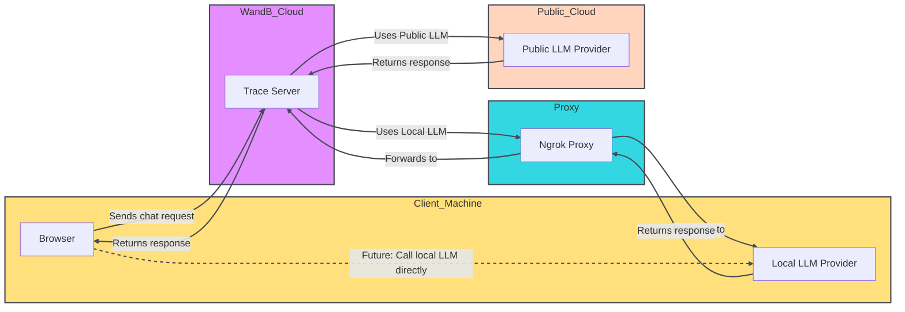

<Tip>
  期間限定で、新しい W\&B Inference サービスが無料枠に含まれています。W\&B Inference は、API と Weave Playground を通じて、主要なオープンソース基盤モデルへのアクセスを提供します。

  * [開発者ドキュメント](../integrations/inference.mdx)
  * [製品ページ](https://wandb.ai/site/inference)
</Tip>

LLM のプロンプトとレスポンスの評価は難しいものです。Weave Playground は、LLM のプロンプトとレスポンスを反復する過程を簡素化し、異なるモデルやプロンプトを試すことを容易にするように設計されています。プロンプト編集、メッセージの再試行、モデル比較などの機能により、Playground は LLM アプリケーションを迅速にテストし改善するのに役立ちます。Playground は現在、OpenAI、Anthropic、Google、Groq、Amazon Bedrock、Microsoft Azure からのモデルに加えて、[カスタムプロバイダー](#add-a-custom-provider)。

* **クイックアクセス：** 新しいセッションには W\&B サイドバーから Playground を開くか、既存のプロジェクトをテストするには Call ページから開きます。
* **メッセージコントロール：** チャット内で直接メッセージの編集、再試行、削除ができます。
* **柔軟なメッセージング：** ユーザーまたはシステム入力として新しいメッセージを追加し、LLM に送信できます。
* **カスタマイズ可能な設定：** お好みの LLM プロバイダーを設定し、モデル設定を調整できます。
* **マルチ LLM サポート：** チームレベルの API キー管理で、モデル間の切り替えが可能です。
* **モデル比較：** 異なるモデルがプロンプトにどのように応答するかを比較できます。
* **カスタムプロバイダー：** カスタムモデル用の OpenAI 互換 API エンドポイントをテストできます。
* **保存済みモデル：** ワークフロー用の再利用可能なモデルプリセットを作成・設定できます

Playground を使って LLM とのやり取りを最適化し、プロンプトエンジニアリングプロセスと LLM アプリケーション開発を効率化しましょう。

* [前提条件](#prerequisites)
  * [プロバイダーの認証情報と情報を追加する](#add-provider-credentials-and-information)
  * [Playground へのアクセス](#access-the-playground)
* [LLM の選択](#select-an-llm)
* [設定のカスタマイズ](#customize-settings)
* [メッセージコントロール](#add-retry-edit-and-delete-messages)
* [LLM の比較](#compare-llms)
* [カスタムプロバイダー](#custom-providers)
* [保存済みモデル](#saved-models)

## 前提条件

Playground を使用する前に、[プロバイダーの認証情報を追加](#add-provider-credentials-and-information)し、[Playground UI を開く](#access-the-playground)必要があります。

### プロバイダーの認証情報と情報を追加する

Playground は現在、OpenAI、Anthropic、Google、Groq、Amazon Bedrock、Microsoft Azure からのモデルをサポートしています。利用可能なモデルのいずれかを使用するには、W\&B 設定のチームシークレットに適切な情報を追加してください。

* OpenAI: `OPENAI_API_KEY`
* Anthropic: `ANTHROPIC_API_KEY`
* Google: `GEMINI_API_KEY`
* Groq: `GROQ_API_KEY`
* Amazon Bedrock:
  * `AWS_ACCESS_KEY_ID`
  * `AWS_SECRET_ACCESS_KEY`
  * `AWS_REGION_NAME`
* Azure:
  * `AZURE_API_KEY`
  * `AZURE_API_BASE`
  * `AZURE_API_VERSION`
* X.AI:
  * `XAI_API_KEY`
* Deepseek
  * `DEEPSEEK_API_KEY`

### Playground へのアクセス

Playground にアクセスするには 2 つの方法があります：

1. *シンプルなシステムプロンプトで新しい Playground ページを開く*：サイドバーで**Playground**を選択します。Playground は同じタブで開きます。
2. *特定の呼び出しに対して Playground を開く*：
   1. サイドバーで**Traces**タブを選択します。トレースのリストが表示されます。
   2. トレースのリストで、表示したい呼び出しの名前をクリックします。呼び出しの詳細ページが開きます。
   3. **Open chat in playground**をクリックします。Playground が新しいタブで開きます。


## LLM の選択

左上のドロップダウンメニューを使用して LLM を切り替えることができます。様々なプロバイダーから利用可能なモデルは以下の通りです：

* [Amazon Bedrock](#amazon-bedrock)
* [Anthropic](#anthropic)
* [Azure](#azure)
* [Google](#google)
* [Groq](#groq)
* [OpenAI](#openai)
* [X.AI](#xai)
* [Deepseek](#deepseek)

{/* USE make update_playground_models */}

{/* LLM_LIST_START, DON'T EDIT THIS SECTION */}

### [Amazon Bedrock](../integrations/bedrock.mdx)

* ai21.j2-mid-v1
* ai21.j2-ultra-v1
* amazon.nova-micro-v1:0
* amazon.nova-lite-v1:0
* amazon.nova-pro-v1:0
* amazon.titan-text-lite-v1
* amazon.titan-text-express-v1
* mistral.mistral-7b-instruct-v0:2
* mistral.mixtral-8x7b-instruct-v0:1
* mistral.mistral-large-2402-v1:0
* mistral.mistral-large-2407-v1:0
* anthropic.claude-3-sonnet-20240229-v1:0
* anthropic.claude-3-5-sonnet-20240620-v1:0
* anthropic.claude-3-haiku-20240307-v1:0
* anthropic.claude-3-opus-20240229-v1:0
* anthropic.claude-v2
* anthropic.claude-v2:1
* anthropic.claude-instant-v1
* cohere.command-text-v14
* cohere.command-light-text-v14
* cohere.command-r-plus-v1:0
* cohere.command-r-v1:0
* meta.llama2-13b-chat-v1
* meta.llama2-70b-chat-v1
* meta.llama3-8b-instruct-v1:0
* meta.llama3-70b-instruct-v1:0
* meta.llama3-1-8b-instruct-v1:0
* meta.llama3-1-70b-instruct-v1:0
* meta.llama3-1-405b-instruct-v1:0

### [Anthropic](../integrations/anthropic.mdx)

* claude-3-7-sonnet-20250219
* claude-3-5-sonnet-20240620
* claude-3-5-sonnet-20241022
* claude-3-haiku-20240307
* claude-3-opus-20240229
* claude-3-sonnet-20240229

### [Azure](../integrations/azure.mdx)

* azure/o1-mini
* azure/o1-mini-2024-09-12
* azure/o1
* azure/o1-preview
* azure/o1-preview-2024-09-12
* azure/gpt-4o
* azure/gpt-4o-2024-08-06
* azure/gpt-4o-2024-11-20
* azure/gpt-4o-2024-05-13
* azure/gpt-4o-mini
* azure/gpt-4o-mini-2024-07-18

### [Google](../integrations/google.mdx)

* gemini/gemini-2.5-pro-preview-03-25
* gemini/gemini-2.0-pro-exp-02-05
* gemini/gemini-2.0-flash-exp
* gemini/gemini-2.0-flash-001
* gemini/gemini-2.0-flash-thinking-exp
* gemini/gemini-2.0-flash-thinking-exp-01-21
* gemini/gemini-2.0-flash
* gemini/gemini-2.0-flash-lite
* gemini/gemini-2.0-flash-lite-preview-02-05
* gemini/gemini-1.5-flash-001
* gemini/gemini-1.5-flash-002
* gemini/gemini-1.5-flash-8b-exp-0827
* gemini/gemini-1.5-flash-8b-exp-0924
* gemini/gemini-1.5-flash-latest
* gemini/gemini-1.5-flash
* gemini/gemini-1.5-pro-001
* gemini/gemini-1.5-pro-002
* gemini/gemini-1.5-pro-latest
* gemini/gemini-1.5-pro

### [Groq](../integrations/groq.mdx)

* groq/deepseek-r1-distill-llama-70b
* groq/llama-3.3-70b-versatile
* groq/llama-3.3-70b-specdec
* groq/llama-3.2-1b-preview
* groq/llama-3.2-3b-preview
* groq/llama-3.2-11b-vision-preview
* groq/llama-3.2-90b-vision-preview
* groq/llama-3.1-8b-instant
* groq/llama3-70b-8192
* groq/llama3-8b-8192
* groq/gemma2-9b-it

### [OpenAI](../integrations/openai.mdx)

* gpt-4.1-mini-2025-04-14
* gpt-4.1-mini
* gpt-4.1-2025-04-14
* gpt-4.1
* gpt-4.1-nano-2025-04-14
* gpt-4.1-nano
* o4-mini-2025-04-16
* o4-mini
* gpt-4.5-preview-2025-02-27
* gpt-4.5-preview
* o3-2025-04-16
* o3
* o3-mini-2025-01-31
* o3-mini
* gpt-4o-mini
* gpt-4o-2024-05-13
* gpt-4o-2024-08-06
* gpt-4o-mini-2024-07-18
* gpt-4o
* gpt-4o-2024-11-20
* o1-mini-2024-09-12
* o1-mini
* o1-preview-2024-09-12
* o1-preview
* o1-2024-12-17
* gpt-4-1106-preview
* gpt-4-32k-0314
* gpt-4-turbo-2024-04-09
* gpt-4-turbo-preview
* gpt-4-turbo
* gpt-4
* gpt-3.5-turbo-0125
* gpt-3.5-turbo-1106

### X.AI

* xai/grok-3-beta
* xai/grok-3-fast-beta
* xai/grok-3-fast-latest
* xai/grok-3-mini-beta
* xai/grok-3-mini-fast-beta
* xai/grok-3-mini-fast-latest
* xai/grok-beta
* xai/grok-2-1212
* xai/grok-2
* xai/grok-2-latest

### Deepseek

* deepseek/deepseek-reasoner
* deepseek/deepseek-chat

{/* LLM_LIST_END, DON'T EDIT THIS SECTION */}

## 設定をカスタマイズ

### LLMパラメータを調整する

選択したモデルのパラメータ値を変更して実験することができます。パラメータを調整するには、以下の手順に従ってください：

1. Playground UIの右上隅にある**チャット設定**をクリックして、パラメータ設定のドロップダウンを開きます。
2. ドロップダウンで、必要に応じてパラメータを調整します。Weaveコールトラッキングのオン/オフを切り替えたり、[関数を追加](#add-a-function)したりすることもできます。
3. **チャット設定**をクリックして、ドロップダウンを閉じ、変更を保存します。


### 関数を追加する

ユーザーから受け取る入力に基づいて、異なるモデルがどのように関数を使用するかをテストできます。Playgroundでテスト用の関数を追加するには、次の手順に従います：

1. Playground UIの右上隅にある**チャット設定**をクリックして、パラメータ設定のドロップダウンを開きます。
2. ドロップダウンで、**+ 関数を追加**をクリックします。
3. ポップアップで、関数情報を追加します。
4. 変更を保存して関数ポップアップを閉じるには、右上隅の**x**をクリックします。
5. **チャット設定**をクリックして、設定ドロップダウンを閉じ、変更を保存します。

### 試行回数を調整する

Playgroundでは、試行回数を設定することで、同じ入力に対して複数の出力を生成できます。デフォルト設定は`1`です。試行回数を調整するには、次の手順に従います：

1. Playground UIで、設定サイドバーがまだ開いていない場合は開きます。
2. **試行回数**を調整します。

## メッセージコントロール

### メッセージの再試行、編集、削除

Playgroundでは、メッセージの再試行、編集、削除ができます。この機能を使用するには、編集、再試行、または削除したいメッセージにカーソルを合わせます。3つのボタンが表示されます：**削除**、**編集**、および**再試行**。

* **削除**：チャットからメッセージを削除します。
* **編集**：メッセージの内容を変更します。
* **再試行**：それ以降のすべてのメッセージを削除し、選択したメッセージからチャットを再試行します。


### 新しいメッセージを追加する

チャットに新しいメッセージを追加するには、次の手順に従います：

1. チャットボックスで、利用可能なロールのいずれかを選択します（**アシスタント**または**ユーザー**）
2. &#xNAN;**+ 追加**をクリックします。
3. LLMに新しいメッセージを送信するには、**送信**ボタンをクリックします。または、**Command**キーと**Enter**キーを押します。


## LLMを比較する

Playgroundでは、LLMを比較することができます。比較を行うには、次の手順に従います：

1. Playground UIで、**比較**をクリックします。元のチャットの隣に2つ目のチャットが開きます。
2. 2つ目のチャットでは、以下のことができます：
   * [比較するLLMを選択する](#select-an-llm)
   * [パラメータを調整する](#adjust-llm-parameters)
   * [関数を追加する](#add-a-function)
3. メッセージボックスに、両方のモデルでテストしたいメッセージを入力し、**送信**を押します。

## カスタムプロバイダー

### カスタムプロバイダーを追加する

[サポートされているプロバイダー](#select-an-llm)に加えて、Playgroundを使用してカスタムモデル用のOpenAI互換APIエンドポイントをテストすることができます。例えば：

* サポートされているモデルプロバイダーの古いバージョン
* ローカルモデル

Playgroundにカスタムプロバイダーを追加するには、次の手順に従います：

1. Playground UIの左上隅にある**モデルを選択**ドロップダウンをクリックします。

2. &#xNAN;**+ AIプロバイダーを追加**を選択します。

3. ポップアップモーダルで、プロバイダー情報を入力します：

   * *プロバイダー名*：例えば、`openai`や`ollama`など。
   * *APIキー*：例えば、OpenAI APIキーなど。
   * *ベースURL*：例えば、`https://api.openai.com/v1/`やngrok URL`https://e452-2600-1700-45f0-3e10-2d3f-796b-d6f2-8ba7.ngrok-free.app`など。
   * *ヘッダー*（オプション）：複数のヘッダーキーと値を追加できます。
   * *モデル*：1つのプロバイダーに対して複数のモデルを追加できます。例えば、`deepseek-r1`や`qwq`など。
   * *最大トークン数*（オプション）：各モデルについて、レスポンスで生成できる最大トークン数を指定できます。

4. プロバイダー情報を入力したら、**Add provider**をクリックします。

5. Playground UIの左上にある**Select a model**ドロップダウンから新しいプロバイダーと利用可能なモデルを選択します。

<Warning>
  CORS制限のため、Playgroundからlocalhostまたは127.0.0.1のURLに直接呼び出すことはできません。ローカルモデルサーバー（Ollamaなど）を実行している場合は、ngrokのようなトンネリングサービスを使用して安全に公開してください。詳細については、[Use ngrok with Ollama](#use-ngrok-with-ollama)をご覧ください。
</Warning>

これで、標準のPlayground機能を使用してカスタムプロバイダーモデルをテストできます。また、カスタムプロバイダーを[edit](#edit-a-custom-provider)または[remove](#remove-a-custom-provider)することもできます。

### カスタムプロバイダーの編集

以前に作成した[previously created custom provider](#add-a-custom-provider)の情報を編集するには、次の手順に従います：

1. Weaveサイドバーで**Overview**に移動します。
2. 上部のナビゲーションメニューから**AI Providers**を選択します。
3. **Custom providers**テーブルで、更新したいカスタムプロバイダーを見つけます。
4. **Last Updated**列のカスタムプロバイダーのエントリで、編集ボタン（鉛筆アイコン）をクリックします。
5. ポップアップモーダルで、プロバイダー情報を編集します。
6. **Save**をクリックします。

### カスタムプロバイダーの削除

以前に作成した[previously created custom provider](#add-a-custom-provider)を削除するには、次の手順に従います：

1. Weaveサイドバーで**Overview**に移動します。
2. 上部のナビゲーションメニューから**AI Providers**を選択します。
3. **Custom providers**テーブルで、更新したいカスタムプロバイダーを見つけます。
4. **Last Updated**列のカスタムプロバイダーのエントリで、削除ボタン（ゴミ箱アイコン）をクリックします。
5. ポップアップモーダルで、プロバイダーを削除することを確認します。この操作は元に戻せません。
6. **Delete**をクリックします。

### Ollamaでngrokを使用する

Playgroundでローカルで実行しているOllamaモデルをテストするには、ngrokを使用してCORS制限を回避する一時的な公開URLを作成します。

セットアップするには、次の手順に従います：

1. [Install ngrok](https://ngrok.com/docs/getting-started/#step-1-install)をお使いのオペレーティングシステム用にインストールします。

2. Ollamaモデルを起動します：

   ```bash
   ollama run <model>
   ```

3. 別のターミナルで、必要なCORSヘッダーを持つngrokトンネルを作成します：

   ```bash
   ngrok http 11434 --response-header-add "Access-Control-Allow-Origin: *" --host-header rewrite
   ```

ngrokが起動すると、`https://xxxx-xxxx.ngrok-free.app`のような公開URLが表示されます。このURLを、PlaygroundでOllamaをカスタムプロバイダーとして追加する際のベースURLとして使用します。

次の図は、ローカル環境、ngrokプロキシ、W\&Bクラウドサービス間のデータフローを示しています：



## 保存されたモデル

### モデルの保存

ワークフロー用の再利用可能なモデルプリセットを作成および設定できます。モデルを保存すると、お好みの設定、パラメータ、関数フックを使用して素早く読み込むことができます。

1. LLMドロップダウンからプロバイダーを選択します。
2. プロバイダーリストからモデルを選択します。
3. Playground UIの右上隅にある**Chat settings**をクリックして、チャット設定ウィンドウを開きます。
4. チャット設定ウィンドウで：
   * **Model Name**フィールドに、保存するモデルの名前を入力します。
   * 必要に応じてパラメータを調整します。Weaveコールトラッキングのオン/オフを切り替えたり、[add a function](#add-a-function)したりすることもできます。
5. **Publish Model**をクリックします。モデルが保存され、LLMドロップダウンの**Saved Models**からアクセスできるようになります。これで保存したモデルを[use](#use-a-saved-model)したり[update](#update-a-saved-model)したりできます。


### 保存したモデルの使用

以前に[saved model](#save-a-model)に素早く切り替えて、実験やセッション間の一貫性を維持します。これにより、中断したところからすぐに再開できます。

1. LLMドロップダウンから**Saved Models**を選択します。
2. 保存されたモデルのリストから、読み込みたい保存モデルをクリックします。モデルが読み込まれ、Playgroundですぐに使用できるようになります。


### 保存したモデルの更新

既存の[saved model](#save-a-model)を編集して、パラメータを微調整したり設定を更新したりします。これにより、保存したモデルがユースケースに合わせて進化することを確保します。

1. LLMドロップダウンから**Saved Models**を選択します。
2. 保存されたモデルのリストから、更新したい保存モデルをクリックします。
3. Playground UIの右上隅にある**Chat settings**をクリックして、チャット設定ウィンドウを開きます。
4. チャット設定ウィンドウで、必要に応じてパラメータを調整します。Weaveコールトラッキングのオン/オフを切り替えたり、[add a function](#add-a-function)したりすることもできます。
5. **Update model**をクリックします。モデルが更新され、LLMドロップダウンの**Saved Models**からアクセスできるようになります。
