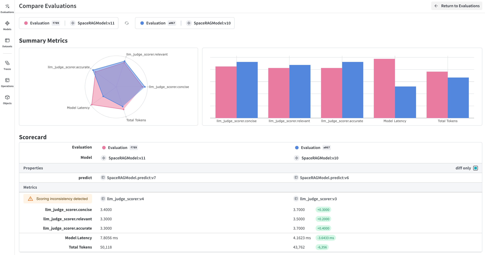

<Note>
  이것은 인터랙티브 노트북입니다. 로컬에서 실행하거나 아래 링크를 사용할 수 있습니다:

  * [Google Colab에서 열기](https://colab.research.google.com/github/wandb/weave/blob/master/docs/notebooks/import_from_csv.ipynb)
  * [GitHub에서 소스 보기](https://github.com/wandb/weave/blob/master/docs/notebooks/import_from_csv.ipynb)
</Note>

# 제3자 시스템에서 트레이스 가져오기

경우에 따라 Weave의 간단한 통합으로 Python이나 Javascript 코드를 계측하여 GenAI 애플리케이션의 실시간 트레이스를 얻는 것이 불가능할 수 있습니다. 이러한 트레이스는 종종 나중에 다음 형식으로 제공됩니다: `csv` 또는 `json` 형식.

이 쿡북에서는 CSV 파일에서 데이터를 추출하고 Weave로 가져와 인사이트와 엄격한 평가를 수행하기 위한 하위 수준 Weave Python API를 살펴봅니다.

이 쿡북에서 가정하는 샘플 데이터셋은 다음과 같은 구조를 가지고 있습니다:

```
conversation_id,turn_index,start_time,user_input,ground_truth,answer_text
1234,1,2024-09-04 13:05:39,This is the beginning, ['This was the beginning'], That was the beginning
1235,1,2024-09-04 13:02:11,This is another trace,, That was another trace
1235,2,2024-09-04 13:04:19,This is the next turn,, That was the next turn
1236,1,2024-09-04 13:02:10,This is a 3 turn conversation,, Woah thats a lot of turns
1236,2,2024-09-04 13:02:30,This is the second turn, ['That was definitely the second turn'], You are correct
1236,3,2024-09-04 13:02:53,This is the end,, Well good riddance!

```

이 쿡북의 가져오기 결정을 이해하려면, Weave 트레이스가 1:다수의 부모-자식 관계를 가지며 연속적이라는 것을 알아야 합니다. 즉, 하나의 부모는 여러 자식을 가질 수 있지만, 그 부모 자체가 다른 부모의 자식일 수도 있습니다.

따라서 우리는 `conversation_id`를 부모 식별자로 사용하고, `turn_index`를 자식 식별자로 사용하여 완전한 대화 로깅을 제공합니다.

필요에 따라 변수를 수정하세요.

# 환경 설정

필요한 모든 패키지를 설치하고 가져옵니다.
환경에 `WANDB_API_KEY`를 설정하여 `wandb.login()`로 쉽게 로그인할 수 있게 합니다(이것은 colab에 비밀로 제공되어야 합니다).

colab에 업로드하는 파일의 이름을 `name_of_file`에 설정하고 이를 로깅할 W\&B 프로젝트를 `name_of_wandb_project`에 설정합니다.

***NOTE:*** `name_of_wandb_project`는 `{team_name}/{project_name}` 형식일 수도 있어 트레이스를 로깅할 팀을 지정합니다.

그런 다음 `weave.init()`

```python
%pip install wandb weave pandas datetime --quiet
python
import os

import pandas as pd
import wandb
from google.colab import userdata

import weave

## Write samples file to disk
with open("/content/import_cookbook_data.csv", "w") as f:
    f.write(
        "conversation_id,turn_index,start_time,user_input,ground_truth,answer_text\n"
    )
    f.write(
        '1234,1,2024-09-04 13:05:39,This is the beginning, ["This was the beginning"], That was the beginning\n'
    )
    f.write(
        "1235,1,2024-09-04 13:02:11,This is another trace,, That was another trace\n"
    )
    f.write(
        "1235,2,2024-09-04 13:04:19,This is the next turn,, That was the next turn\n"
    )
    f.write(
        "1236,1,2024-09-04 13:02:10,This is a 3 turn conversation,, Woah thats a lot of turns\n"
    )
    f.write(
        '1236,2,2024-09-04 13:02:30,This is the second turn, ["That was definitely the second turn"], You are correct\n'
    )
    f.write("1236,3,2024-09-04 13:02:53,This is the end,, Well good riddance!\n")

os.environ["WANDB_API_KEY"] = userdata.get("WANDB_API_KEY")
name_of_file = "/content/import_cookbook_data.csv"
name_of_wandb_project = "import-weave-traces-cookbook"

wandb.login()
python
weave_client = weave.init(name_of_wandb_project)
```

# 데이터 로딩

데이터를 Pandas 데이터프레임으로 로드하고, `conversation_id`와 `turn_index`로 정렬하여 부모와 자식이 올바르게 정렬되도록 합니다.

이렇게 하면 `conversation_data` 아래에 대화 턴이 배열로 있는 두 열의 pandas DF가 생성됩니다.

```python
## Load data and shape it
df = pd.read_csv(name_of_file)

sorted_df = df.sort_values(["conversation_id", "turn_index"])

# Function to create an array of dictionaries for each conversation
def create_conversation_dict_array(group):
    return group.drop("conversation_id", axis=1).to_dict("records")

# Group the dataframe by conversation_id and apply the aggregation
result_df = (
    sorted_df.groupby("conversation_id")
    .apply(create_conversation_dict_array)
    .reset_index()
)
result_df.columns = ["conversation_id", "conversation_data"]

# Show how our aggregation looks
result_df.head()
```

# Weave에 트레이스 로깅하기

이제 pandas DF를 반복합니다:

* 모든 `conversation_id`
* 턴 배열을 반복하여 `turn_index`

하위 수준 Python API의 중요한 개념:

* Weave 호출은 Weave 트레이스와 동일하며, 이 호출은 관련된 부모나 자식을 가질 수 있습니다
* Weave 호출은 피드백, 메타데이터 등 다른 것들과 연결될 수 있습니다. 여기서는 입력과 출력만 연결하지만, 데이터가 제공하는 경우 가져오기에 이러한 항목을 추가할 수 있습니다.
* weave 호출은 `created`되고 `finished`됩니다. 이는 실시간으로 추적되도록 설계되었기 때문입니다. 이것은 사후 가져오기이므로, 객체가 정의되고 서로 연결되면 생성하고 완료합니다.
* 호출의 `op` 값은 Weave가 동일한 구성의 호출을 분류하는 방법입니다. 이 예제에서는 모든 부모 호출은 `Conversation` 유형이고, 모든 자식 호출은 `Turn` 유형입니다. 필요에 따라 이를 수정할 수 있습니다.
* 호출은 `inputs`와 `output`를 가질 수 있습니다. `inputs`는 생성 시 정의되고 `output`는 호출이 완료될 때 정의됩니다.

```python
# Log traces to weave

# Iterate through our aggregated conversations
for _, row in result_df.iterrows():
    # Define our conversation parent,
    # we are now creating a "call" with the weave_client we defined before
    parent_call = weave_client.create_call(
        # The Op value will register this as a Weave Op, which will allow us to retrieve these as a group easily in the future
        op="Conversation",
        # We set the inputs of our high level conversation as all the turns under it
        inputs={
            "conversation_data": row["conversation_data"][:-1]
            if len(row["conversation_data"]) > 1
            else row["conversation_data"]
        },
        # Our Conversation parent does not have a further parent
        parent=None,
        # The name of how this specific conversation will appear in the UI
        display_name=f"conversation-{row['conversation_id']}",
    )

    # We set the output of the parent to be the last trace in the conversation
    parent_output = row["conversation_data"][len(row["conversation_data"]) - 1]

    # We now iterate through all the conversation turns for the parent
    # and log them as children of the conversation
    for item in row["conversation_data"]:
        item_id = f"{row['conversation_id']}-{item['turn_index']}"

        # We create a call again here to be categorized under the conversation
        call = weave_client.create_call(
            # We qualify a single conversation trace as a "Turn"
            op="Turn",
            # We provide all inputs of the turn, including RAG 'ground_truth'
            inputs={
                "turn_index": item["turn_index"],
                "start_time": item["start_time"],
                "user_input": item["user_input"],
                "ground_truth": item["ground_truth"],
            },
            # We set this to be a child of the parent we defined
            parent=parent_call,
            # We provide it a name to be id'ed by in Weave
            display_name=item_id,
        )

        # We set the output of the call as the answer
        output = {
            "answer_text": item["answer_text"],
        }

        # Because these are traces that already happened, we finish the single turn call
        weave_client.finish_call(call=call, output=output)
    # Now that we have logged all its children, we also finish the parent call
    weave_client.finish_call(call=parent_call, output=parent_output)
```

# Result: Traces are Logged to Weave

Traces:


Operations:


# Bonus: Export your traces to run rigorous evaluations!

트레이스가 Weave에 있고 대화가 어떻게 보이는지 이해하게 되면, 나중에 Weave 평가를 실행하기 위해 다른 프로세스로 내보내고 싶을 수 있습니다



이를 위해, 간단한 쿼리 API를 통해 W\&B에서 모든 대화를 가져와 데이터셋을 생성합니다.

```python
## This cell does not run by default, comment the below line to execute this script
%%script false --no-raise-error
## Get all Conversation traces for evaluation and prepare dataset for eval

# We create a query filter that brings us all our Conversation objects
# The ref shown below is specific to your project, and you can obtain it by
# going into your project's Operations in the UI, clicking on the "Conversations"
# object, then the "Use" tab in the side panel.
weave_ref_for_conversation_op = "weave:///wandb-smle/import-weave-traces-cookbook/op/Conversation:tzUhDyzVm5bqQsuqh5RT4axEXSosyLIYZn9zbRyenaw"
filter = weave.trace_server.trace_server_interface.CallsFilter(
    op_names=[weave_ref_for_conversation_op],
  )

# We execute the query
conversation_traces = weave_client.get_calls(filter=filter)

rows = []

# We go through our conversation traces and construct dataset rows from it
for single_conv in conversation_traces:
  # In this example, we may only care for conversations that utilized our RAG
  # pipeline, so we filter for such types of conversations
  is_rag = False
  for single_trace in single_conv.inputs['conversation_data']:
    if single_trace['ground_truth'] is not None:
      is_rag = True
      break
  if single_conv.output['ground_truth'] is not None:
      is_rag = True

  # Once we've identified a converation to have used RAG, we add it to our dataset
  if is_rag:
    inputs = []
    ground_truths = []
    answers = []

    # We go through every turn in the conversation
    for turn in single_conv.inputs['conversation_data']:
      inputs.append(turn.get('user_input', ''))
      ground_truths.append(turn.get('ground_truth', ''))
      answers.append(turn.get('answer_text', ''))
    ## Account for when conversations are a single turn
    if len(single_conv.inputs) != 1 or single_conv.inputs['conversation_data'][0].get('turn_index') != single_conv.output.get('turn_index'):
      inputs.append(single_conv.output.get('user_input', ''))
      ground_truths.append(single_conv.output.get('ground_truth', ''))
      answers.append(single_conv.output.get('answer_text', ''))

    data = {
        'question': inputs,
        'contexts': ground_truths,
        'answer': answers
    }

    rows.append(data)

# With our dataset rows created, we create the Dataset object and
# publish it back to Weave for later retrieval
dset = weave.Dataset(name = "conv_traces_for_eval", rows=rows)
weave.publish(dset)
```

# 결과


평가에 대해 더 알아보려면 [빠른 시작](https://weave-docs.wandb.ai/tutorial-rag)을 확인하여 새로 생성된 데이터셋을 사용하여 RAG 애플리케이션을 평가하세요!
