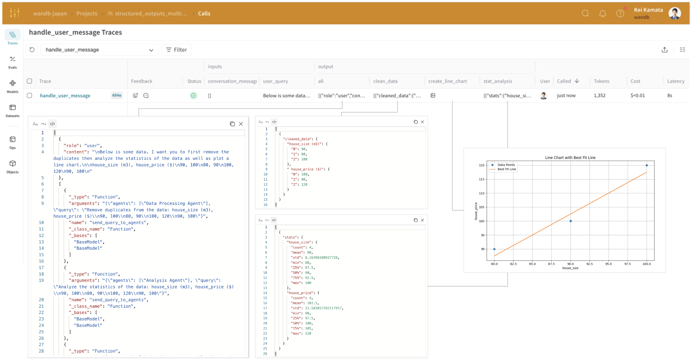

<Note>
  이것은 인터랙티브 노트북입니다. 로컬에서 실행하거나 아래 링크를 사용할 수 있습니다:

  * [Google Colab에서 열기](https://colab.research.google.com/github/wandb/weave/blob/master/docs/notebooks/multi-agent-structured-output.ipynb)
  * [GitHub에서 소스 보기](https://github.com/wandb/weave/blob/master/docs/notebooks/multi-agent-structured-output.ipynb)
</Note>

##

# 다중 에이전트 시스템을 위한 구조화된 출력

OpenAI는 [Structured Outputs](https://openai.com/index/introducing-structured-outputs-in-the-api/)을 출시하여 사용자가 강력한 프롬프트 없이도 모델이 항상 제공된 JSON 스키마를 준수하는 응답을 생성하도록 할 수 있게 했습니다. Structured Outputs를 사용하면 잘못된 형식의 응답을 검증하거나 재시도할 필요가 없습니다.

새로운 매개변수 `strict: true`를 사용함으로써, 응답이 제공된 스키마를 준수하도록 보장할 수 있습니다.

다중 에이전트 시스템에서 구조화된 출력을 사용하면 에이전트 간에 일관되고 쉽게 처리할 수 있는 데이터를 보장하여 통신을 향상시킵니다. 또한 명시적인 거부를 허용하여 안전성을 개선하고 재시도나 검증이 필요 없어 성능을 향상시킵니다. 이는 상호작용을 단순화하고 전체 시스템 효율성을 증가시킵니다.

이 튜토리얼은 다중 에이전트 시스템에서 구조화된 출력을 활용하고 [Weave](https://weave-docs.wandb.ai/)로 추적하는 방법을 보여줍니다.

<Tip>
  **출처**: 이 쿡북은 [OpenAI의 구조화된 출력 샘플 코드](https://cookbook.openai.com/examples/structured_outputs_multi_agent)를 기반으로 하며, Weave를 사용한 시각화 개선을 위해 일부 수정이 추가되었습니다.
</Tip>

## 의존성 설치하기

이 튜토리얼에는 다음 라이브러리가 필요합니다:

* [OpenAI](https://openai.com/index/openai-api/) - 다중 에이전트 시스템을 만들기 위해.
* [Weave](../../introduction.md) - LLM 워크플로우를 추적하고 프롬프팅 전략을 평가하기 위해.

```python
!pip install -qU openai weave wandb
python
%%capture
# Temporary workaround to fix bug in openai:
# TypeError: Client.__init__() got an unexpected keyword argument 'proxies'
# See https://community.openai.com/t/error-with-openai-1-56-0-client-init-got-an-unexpected-keyword-argument-proxies/1040332/15
!pip install "httpx<0.28"
```

환경에 `WANDB_API_KEY`를 설정하여 wandb.login()으로 쉽게 로그인할 수 있게 합니다(이는 colab에 비밀로 제공되어야 함).

로그를 남길 W\&B 프로젝트를 `name_of_wandb_project`에 설정합니다.

**참고**: `name_of_wandb_project`는 `{team_name}/{project_name}` 형식으로도 지정할 수 있어 추적 로그를 남길 팀을 지정할 수 있습니다.
그런 다음 weave.init()을 호출하여 weave 클라이언트를 가져옵니다

우리는 [OpenAI API](https://openai.com/index/openai-api/)를 사용할 것이므로, OpenAI API 키도 필요합니다. OpenAI 플랫폼에서 [가입](https://platform.openai.com/signup)하여 자신의 API 키를 얻을 수 있습니다. (이것도 colab에 비밀로 제공되어야 함)

```python
import base64
import json
import os
from io import BytesIO, StringIO

import matplotlib.pyplot as plt
import numpy as np
import pandas as pd
import wandb
from google.colab import userdata
from openai import OpenAI

import weave
python
os.environ["WANDB_API_KEY"] = userdata.get("WANDB_API_KEY")
os.environ["OPENAI_API_KEY"] = userdata.get("OPENAI_API_KEY")

wandb.login()
name_of_wandb_project = "multi-agent-structured-output"
weave.init(name_of_wandb_project)

client = OpenAI()
MODEL = "gpt-4o-2024-08-06"
```

## 에이전트 설정

우리가 다룰 사용 사례는 데이터 분석 작업입니다.
먼저 4개의 에이전트 시스템을 설정해 보겠습니다:

* 분류 에이전트: 어떤 에이전트를 호출할지 결정
* 데이터 전처리 에이전트: 데이터 정리 등을 통해 분석을 위한 데이터 준비
* 데이터 분석 에이전트: 데이터에 대한 분석 수행
* 데이터 시각화 에이전트: 분석 결과를 시각화하여 인사이트 추출
  먼저 각 에이전트의 시스템 프롬프트를 정의할 것입니다.

```python
triaging_system_prompt = """You are a Triaging Agent. Your role is to assess the user's query and route it to the relevant agents. The agents available are:
- Data Processing Agent: Cleans, transforms, and aggregates data.
- Analysis Agent: Performs statistical, correlation, and regression analysis.
- Visualization Agent: Creates bar charts, line charts, and pie charts.

Use the send_query_to_agents tool to forward the user's query to the relevant agents. Also, use the speak_to_user tool to get more information from the user if needed."""

processing_system_prompt = """You are a Data Processing Agent. Your role is to clean, transform, and aggregate data using the following tools:
- clean_data
- transform_data
- aggregate_data"""

analysis_system_prompt = """You are an Analysis Agent. Your role is to perform statistical, correlation, and regression analysis using the following tools:
- stat_analysis
- correlation_analysis
- regression_analysis"""

visualization_system_prompt = """You are a Visualization Agent. Your role is to create bar charts, line charts, and pie charts using the following tools:
- create_bar_chart
- create_line_chart
- create_pie_chart"""
```

그런 다음 각 에이전트의 도구를 정의할 것입니다.

분류 에이전트를 제외한 각 에이전트는 자신의 역할에 맞는 특정 도구를 갖추게 됩니다:

**데이터 전처리 에이전트**: 1. 데이터 정리, 2. 데이터 변환, 3. 데이터 집계

**데이터 분석 에이전트**: 1. 통계 분석, 2. 상관관계 분석, 3. 회귀 분석

**데이터 시각화 에이전트**: 1. 막대 차트 생성, 2. 선 차트 생성, 3. 파이 차트 생성

```python
triage_tools = [
    {
        "type": "function",
        "function": {
            "name": "send_query_to_agents",
            "description": "Sends the user query to relevant agents based on their capabilities.",
            "parameters": {
                "type": "object",
                "properties": {
                    "agents": {
                        "type": "array",
                        "items": {"type": "string"},
                        "description": "An array of agent names to send the query to.",
                    },
                    "query": {
                        "type": "string",
                        "description": "The user query to send.",
                    },
                },
                "required": ["agents", "query"],
            },
        },
        "strict": True,
    }
]

preprocess_tools = [
    {
        "type": "function",
        "function": {
            "name": "clean_data",
            "description": "Cleans the provided data by removing duplicates and handling missing values.",
            "parameters": {
                "type": "object",
                "properties": {
                    "data": {
                        "type": "string",
                        "description": "The dataset to clean. Should be in a suitable format such as JSON or CSV.",
                    }
                },
                "required": ["data"],
                "additionalProperties": False,
            },
        },
        "strict": True,
    },
    {
        "type": "function",
        "function": {
            "name": "transform_data",
            "description": "Transforms data based on specified rules.",
            "parameters": {
                "type": "object",
                "properties": {
                    "data": {
                        "type": "string",
                        "description": "The data to transform. Should be in a suitable format such as JSON or CSV.",
                    },
                    "rules": {
                        "type": "string",
                        "description": "Transformation rules to apply, specified in a structured format.",
                    },
                },
                "required": ["data", "rules"],
                "additionalProperties": False,
            },
        },
        "strict": True,
    },
    {
        "type": "function",
        "function": {
            "name": "aggregate_data",
            "description": "Aggregates data by specified columns and operations.",
            "parameters": {
                "type": "object",
                "properties": {
                    "data": {
                        "type": "string",
                        "description": "The data to aggregate. Should be in a suitable format such as JSON or CSV.",
                    },
                    "group_by": {
                        "type": "array",
                        "items": {"type": "string"},
                        "description": "Columns to group by.",
                    },
                    "operations": {
                        "type": "string",
                        "description": "Aggregation operations to perform, specified in a structured format.",
                    },
                },
                "required": ["data", "group_by", "operations"],
                "additionalProperties": False,
            },
        },
        "strict": True,
    },
]

analysis_tools = [
    {
        "type": "function",
        "function": {
            "name": "stat_analysis",
            "description": "Performs statistical analysis on the given dataset.",
            "parameters": {
                "type": "object",
                "properties": {
                    "data": {
                        "type": "string",
                        "description": "The dataset to analyze. Should be in a suitable format such as JSON or CSV.",
                    }
                },
                "required": ["data"],
                "additionalProperties": False,
            },
        },
        "strict": True,
    },
    {
        "type": "function",
        "function": {
            "name": "correlation_analysis",
            "description": "Calculates correlation coefficients between variables in the dataset.",
            "parameters": {
                "type": "object",
                "properties": {
                    "data": {
                        "type": "string",
                        "description": "The dataset to analyze. Should be in a suitable format such as JSON or CSV.",
                    },
                    "variables": {
                        "type": "array",
                        "items": {"type": "string"},
                        "description": "List of variables to calculate correlations for.",
                    },
                },
                "required": ["data", "variables"],
                "additionalProperties": False,
            },
        },
        "strict": True,
    },
    {
        "type": "function",
        "function": {
            "name": "regression_analysis",
            "description": "Performs regression analysis on the dataset.",
            "parameters": {
                "type": "object",
                "properties": {
                    "data": {
                        "type": "string",
                        "description": "The dataset to analyze. Should be in a suitable format such as JSON or CSV.",
                    },
                    "dependent_var": {
                        "type": "string",
                        "description": "The dependent variable for regression.",
                    },
                    "independent_vars": {
                        "type": "array",
                        "items": {"type": "string"},
                        "description": "List of independent variables.",
                    },
                },
                "required": ["data", "dependent_var", "independent_vars"],
                "additionalProperties": False,
            },
        },
        "strict": True,
    },
]

visualization_tools = [
    {
        "type": "function",
        "function": {
            "name": "create_bar_chart",
            "description": "Creates a bar chart from the provided data.",
            "parameters": {
                "type": "object",
                "properties": {
                    "data": {
                        "type": "string",
                        "description": "The data for the bar chart. Should be in a suitable format such as JSON or CSV.",
                    },
                    "x": {"type": "string", "description": "Column for the x-axis."},
                    "y": {"type": "string", "description": "Column for the y-axis."},
                },
                "required": ["data", "x", "y"],
                "additionalProperties": False,
            },
        },
        "strict": True,
    },
    {
        "type": "function",
        "function": {
            "name": "create_line_chart",
            "description": "Creates a line chart from the provided data.",
            "parameters": {
                "type": "object",
                "properties": {
                    "data": {
                        "type": "string",
                        "description": "The data for the line chart. Should be in a suitable format such as JSON or CSV.",
                    },
                    "x": {"type": "string", "description": "Column for the x-axis."},
                    "y": {"type": "string", "description": "Column for the y-axis."},
                },
                "required": ["data", "x", "y"],
                "additionalProperties": False,
            },
        },
        "strict": True,
    },
    {
        "type": "function",
        "function": {
            "name": "create_pie_chart",
            "description": "Creates a pie chart from the provided data.",
            "parameters": {
                "type": "object",
                "properties": {
                    "data": {
                        "type": "string",
                        "description": "The data for the pie chart. Should be in a suitable format such as JSON or CSV.",
                    },
                    "labels": {
                        "type": "string",
                        "description": "Column for the labels.",
                    },
                    "values": {
                        "type": "string",
                        "description": "Column for the values.",
                    },
                },
                "required": ["data", "labels", "values"],
                "additionalProperties": False,
            },
        },
        "strict": True,
    },
]
```

## Weave를 사용한 다중 에이전트 추적 활성화

다음과 같은 코드 로직을 작성해야 합니다:

* 사용자 쿼리를 다중 에이전트 시스템에 전달하는 처리
* 다중 에이전트 시스템의 내부 작동 처리
* 도구 호출 실행

```python
# Example query

user_query = """
Below is some data. I want you to first remove the duplicates then analyze the statistics of the data as well as plot a line chart.

house_size (m3), house_price ($)
90, 100
80, 90
100, 120
90, 100
"""
```

사용자 쿼리에서 우리가 호출해야 할 도구는 `clean_data`, `start_analysis` 및 `use_line_chart`임을 추론할 수 있습니다.

먼저 도구 호출을 실행하는 실행 함수를 정의할 것입니다.

Python 함수를 `@weave.op()`로 장식하면 언어 모델 입력, 출력 및 추적을 로깅하고 디버깅할 수 있습니다.

다중 에이전트 시스템을 만들 때 많은 함수가 나타나지만, 단순히 그 위에 `@weave.op()`를 추가하는 것으로 충분합니다.

```python
@weave.op()
def clean_data(data):
    data_io = StringIO(data)
    df = pd.read_csv(data_io, sep=",")
    df_deduplicated = df.drop_duplicates()
    return df_deduplicated

@weave.op()
def stat_analysis(data):
    data_io = StringIO(data)
    df = pd.read_csv(data_io, sep=",")
    return df.describe()

@weave.op()
def plot_line_chart(data):
    data_io = StringIO(data)
    df = pd.read_csv(data_io, sep=",")

    x = df.iloc[:, 0]
    y = df.iloc[:, 1]

    coefficients = np.polyfit(x, y, 1)
    polynomial = np.poly1d(coefficients)
    y_fit = polynomial(x)

    plt.figure(figsize=(10, 6))
    plt.plot(x, y, "o", label="Data Points")
    plt.plot(x, y_fit, "-", label="Best Fit Line")
    plt.title("Line Chart with Best Fit Line")
    plt.xlabel(df.columns[0])
    plt.ylabel(df.columns[1])
    plt.legend()
    plt.grid(True)

    # Save the plot to a BytesIO buffer before showing it
    buf = BytesIO()
    plt.savefig(buf, format="png")
    buf.seek(0)

    # Display the plot
    plt.show()

    # Encode the image in base64 for the data URL
    image_data = buf.getvalue()
    base64_encoded_data = base64.b64encode(image_data)
    base64_string = base64_encoded_data.decode("utf-8")
    data_url = f"data:image/png;base64,{base64_string}"

    return data_url

# Define the function to execute the tools
@weave.op()
def execute_tool(tool_calls, messages):
    for tool_call in tool_calls:
        tool_name = tool_call.function.name
        tool_arguments = json.loads(tool_call.function.arguments)

        if tool_name == "clean_data":
            # Simulate data cleaning
            cleaned_df = clean_data(tool_arguments["data"])
            cleaned_data = {"cleaned_data": cleaned_df.to_dict()}
            messages.append(
                {"role": "tool", "name": tool_name, "content": json.dumps(cleaned_data)}
            )
            print("Cleaned data: ", cleaned_df)
        elif tool_name == "transform_data":
            # Simulate data transformation
            transformed_data = {"transformed_data": "sample_transformed_data"}
            messages.append(
                {
                    "role": "tool",
                    "name": tool_name,
                    "content": json.dumps(transformed_data),
                }
            )
        elif tool_name == "aggregate_data":
            # Simulate data aggregation
            aggregated_data = {"aggregated_data": "sample_aggregated_data"}
            messages.append(
                {
                    "role": "tool",
                    "name": tool_name,
                    "content": json.dumps(aggregated_data),
                }
            )
        elif tool_name == "stat_analysis":
            # Simulate statistical analysis
            stats_df = stat_analysis(tool_arguments["data"])
            stats = {"stats": stats_df.to_dict()}
            messages.append(
                {"role": "tool", "name": tool_name, "content": json.dumps(stats)}
            )
            print("Statistical Analysis: ", stats_df)
        elif tool_name == "correlation_analysis":
            # Simulate correlation analysis
            correlations = {"correlations": "sample_correlations"}
            messages.append(
                {"role": "tool", "name": tool_name, "content": json.dumps(correlations)}
            )
        elif tool_name == "regression_analysis":
            # Simulate regression analysis
            regression_results = {"regression_results": "sample_regression_results"}
            messages.append(
                {
                    "role": "tool",
                    "name": tool_name,
                    "content": json.dumps(regression_results),
                }
            )
        elif tool_name == "create_bar_chart":
            # Simulate bar chart creation
            bar_chart = {"bar_chart": "sample_bar_chart"}
            messages.append(
                {"role": "tool", "name": tool_name, "content": json.dumps(bar_chart)}
            )
        elif tool_name == "create_line_chart":
            # Simulate line chart creation
            line_chart = {"line_chart": plot_line_chart(tool_arguments["data"])}
            messages.append(
                {"role": "tool", "name": tool_name, "content": json.dumps(line_chart)}
            )
        elif tool_name == "create_pie_chart":
            # Simulate pie chart creation
            pie_chart = {"pie_chart": "sample_pie_chart"}
            messages.append(
                {"role": "tool", "name": tool_name, "content": json.dumps(pie_chart)}
            )
    return messages
```

다음으로, 각 하위 에이전트에 대한 도구 핸들러를 만들 것입니다. 이들은 모델에 전달되는 고유한 프롬프트와 도구 세트를 가지고 있습니다. 그런 다음 출력은 도구 호출을 실행하는 실행 함수로 전달됩니다.

```python
# Define the functions to handle each agent's processing
@weave.op()
def handle_data_processing_agent(query, conversation_messages):
    messages = [{"role": "system", "content": processing_system_prompt}]
    messages.append({"role": "user", "content": query})

    response = client.chat.completions.create(
        model=MODEL,
        messages=messages,
        temperature=0,
        tools=preprocess_tools,
    )

    conversation_messages.append(
        [tool_call.function for tool_call in response.choices[0].message.tool_calls]
    )
    execute_tool(response.choices[0].message.tool_calls, conversation_messages)

@weave.op()
def handle_analysis_agent(query, conversation_messages):
    messages = [{"role": "system", "content": analysis_system_prompt}]
    messages.append({"role": "user", "content": query})

    response = client.chat.completions.create(
        model=MODEL,
        messages=messages,
        temperature=0,
        tools=analysis_tools,
    )

    conversation_messages.append(
        [tool_call.function for tool_call in response.choices[0].message.tool_calls]
    )
    execute_tool(response.choices[0].message.tool_calls, conversation_messages)

@weave.op()
def handle_visualization_agent(query, conversation_messages):
    messages = [{"role": "system", "content": visualization_system_prompt}]
    messages.append({"role": "user", "content": query})

    response = client.chat.completions.create(
        model=MODEL,
        messages=messages,
        temperature=0,
        tools=visualization_tools,
    )

    conversation_messages.append(
        [tool_call.function for tool_call in response.choices[0].message.tool_calls]
    )
    execute_tool(response.choices[0].message.tool_calls, conversation_messages)
```

마지막으로, 사용자 쿼리 처리를 담당하는 상위 도구를 만듭니다. 이 함수는 사용자 쿼리를 받아 모델로부터 응답을 얻고 이를 다른 에이전트에게 전달하여 실행하도록 처리합니다.

```python
# Function to handle user input and triaging
@weave.op()
def handle_user_message(user_query, conversation_messages=None):
    if conversation_messages is None:
        conversation_messages = []
    user_message = {"role": "user", "content": user_query}
    conversation_messages.append(user_message)

    messages = [{"role": "system", "content": triaging_system_prompt}]
    messages.extend(conversation_messages)

    response = client.chat.completions.create(
        model=MODEL,
        messages=messages,
        temperature=0,
        tools=triage_tools,
    )

    conversation_messages.append(
        [tool_call.function for tool_call in response.choices[0].message.tool_calls]
    )

    for tool_call in response.choices[0].message.tool_calls:
        if tool_call.function.name == "send_query_to_agents":
            agents = json.loads(tool_call.function.arguments)["agents"]
            query = json.loads(tool_call.function.arguments)["query"]
            for agent in agents:
                if agent == "Data Processing Agent":
                    handle_data_processing_agent(query, conversation_messages)
                elif agent == "Analysis Agent":
                    handle_analysis_agent(query, conversation_messages)
                elif agent == "Visualization Agent":
                    handle_visualization_agent(query, conversation_messages)

    outputs = extract_tool_contents(conversation_messages)

    return outputs

functions = [
    "clean_data",
    "transform_data",
    "stat_analysis",
    "aggregate_data",
    "correlation_analysis",
    "regression_analysis",
    "create_bar_chart",
    "create_line_chart",
    "create_pie_chart",
]

@weave.op()
def extract_tool_contents(data):
    contents = {}
    contents["all"] = data
    for element in data:
        if (
            isinstance(element, dict)
            and element.get("role") == "tool"
            and element.get("name") in functions
        ):
            name = element["name"]
            content_str = element["content"]
            try:
                content_json = json.loads(content_str)
                if "chart" not in element.get("name"):
                    contents[name] = [content_json]
                else:
                    first_key = next(iter(content_json))
                    second_level = content_json[first_key]
                    if isinstance(second_level, dict):
                        second_key = next(iter(second_level))
                        contents[name] = second_level[second_key]
                    else:
                        contents[name] = second_level
            except json.JSONDecodeError:
                print(f"Error decoding JSON for {name}")
                contents[name] = None

    return contents
```

## 다중 에이전트 시스템 실행 및 Weave에서 시각화

마지막으로, 사용자의 입력을 사용하여 주요 `handle_user_message` 함수를 실행하고 결과를 관찰합니다.

```python
handle_user_message(user_query)
```

Weave URL을 클릭하면 실행이 다음과 같이 추적되는 것을 볼 수 있습니다. Traces 페이지에서 입력과 출력을 확인할 수 있습니다. 명확성을 위해 각 출력을 클릭했을 때 표시되는 결과의 스크린샷이 다이어그램에 추가되었습니다. Weave는 OpenAI API와 통합되어 비용이 자동으로 계산됩니다. 따라서 오른쪽 끝에 비용과 지연 시간도 표시됩니다.


한 줄을 클릭하면 다중 에이전트 시스템 내에서 실행된 중간 프로세스를 볼 수 있습니다. 예를 들어, `analysis_agent`의 입력과 출력을 보면 구조화된 출력 형식임을 알 수 있습니다. OpenAI의 구조화된 출력은 에이전트 간 협업을 용이하게 하지만, 시스템이 복잡해질수록 이러한 상호작용이 어떤 형식으로 이루어지는지 파악하기 어려워집니다. Weave를 사용하면 이러한 중간 프로세스와 그 입력 및 출력을 마치 손에 들고 있는 것처럼 이해할 수 있습니다.


Weave에서 추적이 어떻게 처리되는지 자세히 살펴보세요!

## 결론

이 튜토리얼에서는 OpenAI에서 제공하는 구조화된 출력과 Weave를 사용하여 입력, 최종 출력 및 중간 출력 형식을 추적하는 다중 에이전트 시스템을 편리하게 개발하는 방법을 배웠습니다.
