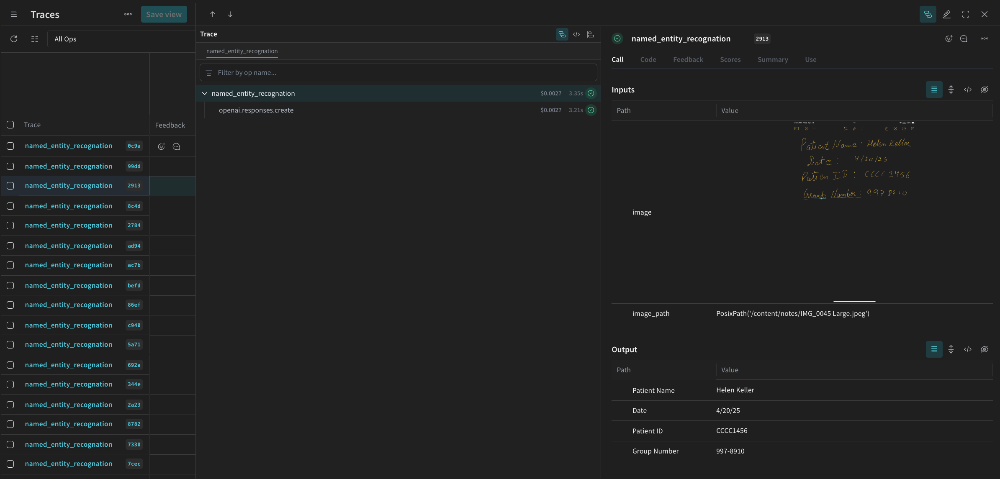

<Note>
  이것은 인터랙티브 노트북입니다. 로컬에서 실행하거나 아래 링크를 사용할 수 있습니다:

  * [Google Colab에서 열기](https://colab.research.google.com/github/wandb/weave/blob/master/docs/notebooks/ocr-pipeline.ipynb)
  * [GitHub에서 소스 보기](https://github.com/wandb/weave/blob/master/docs/notebooks/ocr-pipeline.ipynb)
</Note>

## 사전 요구사항

시작하기 전에 필요한 라이브러리를 설치하고 가져오고, W\&B API 키를 얻은 다음 Weave 프로젝트를 초기화하세요.

```python
# Install the required dependencies
!pip install openai weave -q
python
import json
import os

from google.colab import userdata
from openai import OpenAI

import weave
python
# Get API Keys
os.environ["OPENAI_API_KEY"] = userdata.get(
    "OPENAI_API_KEY"
)  # please set the keys as collab environment secrets from the menu on the left
os.environ["WANDB_API_KEY"] = userdata.get("WANDB_API_KEY")

# Set project name
# Replace the PROJECT value with your project name
PROJECT = "vlm-handwritten-ner"

# Initiatlize the Weave project
weave.init(PROJECT)
```

## 1. Weave로 프롬프트 생성 및 반복하기

좋은 프롬프트 엔지니어링은 모델이 엔티티를 적절하게 추출하도록 안내하는 데 중요합니다. 먼저, 이미지 데이터에서 무엇을 추출하고 어떻게 형식을 지정할지에 대한 지침을 모델에 제공하는 기본 프롬프트를 만들 것입니다. 그런 다음 추적 및 반복을 위해 Weave에 프롬프트를 저장합니다.

````python
# Create your prompt object with Weave
prompt = """
Extract all readable text from this image. Format the extracted entities as a valid JSON.
Do not return any extra text, just the JSON. Do not include ```json```
Use the following format:
{"Patient Name": "James James","Date": "4/22/2025","Patient ID": "ZZZZZZZ123","Group Number": "3452542525"}
"""
system_prompt = weave.StringPrompt(prompt)
# Publish your prompt to Weave
weave.publish(system_prompt, name="NER-prompt")
````

다음으로, 더 많은 지침과 유효성 검사 규칙을 추가하여 출력 오류를 줄이는 데 도움이 되도록 프롬프트를 개선합니다.

````python
better_prompt = """
You are a precision OCR assistant. Given an image of patient information, extract exactly these fields into a single JSON object—and nothing else:

- Patient Name
- Date (MM/DD/YYYY)
- Patient ID
- Group Number

Validation rules:
1. Date must match MM/DD/YY; if not, set Date to "".
2. Patient ID must be alphanumeric; if unreadable, set to "".
3. Always zero-pad months and days (e.g. "04/07/25").
4. Omit any markup, commentary, or code fences.
5. Return strictly valid JSON with only those four keys.

Do not return any extra text, just the JSON. Do not include ```json```
Example output:
{"Patient Name":"James James","Date":"04/22/25","Patient ID":"ZZZZZZZ123","Group Number":"3452542525"}
"""
# Edit the prompt
system_prompt = weave.StringPrompt(better_prompt)
# Publish the edited prompt to Weave
weave.publish(system_prompt, name="NER-prompt")
````

## 2. 데이터셋 가져오기

다음으로, OCR 파이프라인의 입력으로 사용할 손글씨 노트 데이터셋을 검색합니다.

데이터셋의 이미지는 이미 `base64` 인코딩되어 있어 전처리 없이 LLM에서 데이터를 사용할 수 있습니다.

```python
# Retrieve the dataset from the following Weave project
dataset = weave.ref(
    "weave:///wandb-smle/vlm-handwritten-ner/object/NER-eval-dataset:G8MEkqWBtvIxPYAY23sXLvqp8JKZ37Cj0PgcG19dGjw"
).get()

# Access a specific example in the dataset
example_image = dataset.rows[3]["image_base64"]

# Display the example_image
from IPython.display import HTML, display

html = f''
display(HTML(html))
```

## 3. NER 파이프라인 구축하기

다음으로, NER 파이프라인을 구축합니다. 파이프라인은 두 가지 함수로 구성됩니다:

1. 데이터셋에서 PIL 이미지를 가져와 `encode_image` VLM에 전달할 수 있는 인코딩된 문자열 표현을 반환하는 함수`base64` VLM에 전달할 수 있는 이미지의 인코딩된 문자열 표현
2. 이미지와 시스템 프롬프트를 받아 `extract_named_entities_from_image` 시스템 프롬프트에 설명된 대로 해당 이미지에서 추출된 엔티티를 반환하는 함수

```python
# Traceable function using GPT-4-Vision
def extract_named_entities_from_image(image_base64) -> dict:
    # init LLM Client
    client = OpenAI()

    # Setup the instruction prompt
    # You can optionally use a prompt stored in Weave withweave.ref("weave:///wandb-smle/vlm-handwritten-ner/object/NER-prompt:FmCv4xS3RFU21wmNHsIYUFal3cxjtAkegz2ylM25iB8").get().content.strip()
    prompt = better_prompt

    response = client.responses.create(
        model="gpt-4.1",
        input=[
            {
                "role": "user",
                "content": [
                    {"type": "input_text", "text": prompt},
                    {
                        "type": "input_image",
                        "image_url": image_base64,
                    },
                ],
            }
        ],
    )

    return response.output_text
```

이제 다음과 같은 함수를 만듭니다 `named_entity_recognation` that:

* 이미지 데이터를 NER 파이프라인에 전달합니다
* 결과가 포함된 올바르게 형식이 지정된 JSON을 반환합니다

다음을 사용하세요 [`@weave.op()` 데코레이터](https://weave-docs.wandb.ai/reference/python-sdk/weave/trace/weave.trace.op) 데코레이터를 사용하여 W\&B UI에서 함수 실행을 자동으로 추적하고 트레이스합니다.

모든 `named_entity_recognation` 실행 시, 전체 트레이스 결과는 Weave UI에서 볼 수 있습니다. 트레이스를 보려면 Weave 프로젝트의 **Traces** 탭으로 이동하세요.

```python
# NER Function for evaluations
@weave.op()
def named_entity_recognation(image_base64, id):
    result = {}
    try:
        # 1) call the vision op, get back a JSON string
        output_text = extract_named_entities_from_image(image_base64)

        # 2) parse JSON exactly once
        result = json.loads(output_text)

        print(f"Processed: {str(id)}")
    except Exception as e:
        print(f"Failed to process {str(id)}: {e}")
    return result
```

마지막으로, 데이터셋에 대해 파이프라인을 실행하고 결과를 확인합니다.

다음 코드는 데이터셋을 반복하고 결과를 로컬 파일 `processing_results.json`에 저장합니다. 결과는 Weave UI에서도 볼 수 있습니다.

```python
# Output results
results = []

# loop over all images in the dataset
for row in dataset.rows:
    result = named_entity_recognation(row["image_base64"], str(row["id"]))
    result["image_id"] = str(row["id"])
    results.append(result)

# Save all results to a JSON file
output_file = "processing_results.json"
with open(output_file, "w") as f:
    json.dump(results, f, indent=2)

print(f"Results saved to: {output_file}")
```

Weave UI의 **Traces** 테이블에서 다음과 유사한 내용을 볼 수 있습니다.



## 4. Weave를 사용하여 파이프라인 평가하기

이제 VLM을 사용하여 NER을 수행하는 파이프라인을 만들었으므로 Weave를 사용하여 체계적으로 평가하고 얼마나 잘 수행되는지 알아볼 수 있습니다. Weave의 평가에 대해 더 자세히 알아보려면 [Evaluations Overview](https://weave-docs.wandb.ai/guides/core-types/evaluations)를 참조하세요.

Weave 평가의 기본적인 부분은 [Scorers](https://weave-docs.wandb.ai/guides/evaluation/scorers)입니다. Scorers는 AI 출력을 평가하고 평가 메트릭을 반환하는 데 사용됩니다. 이들은 AI의 출력을 가져와 분석하고 결과 사전을 반환합니다. Scorers는 필요한 경우 참조로 입력 데이터를 사용할 수 있으며 평가에서 설명이나 추론과 같은 추가 정보를 출력할 수도 있습니다.

이 섹션에서는 파이프라인을 평가하기 위한 두 가지 Scorers를 만들 것입니다:

1. 프로그래매틱 Scorer
2. LLM-as-a-judge Scorer

### 프로그래매틱 scorer

프로그래매틱 scorer인 `check_for_missing_fields_programatically`는 모델 출력(`named_entity_recognition` 함수의 출력)을 가져와 결과에서 어떤 `keys`가 누락되었거나 비어 있는지 식별합니다.

이 검사는 모델이 필드를 캡처하지 못한 샘플을 식별하는 데 좋습니다.

```python
# Add weave.op() to track execution of the scorer
@weave.op()
def check_for_missing_fields_programatically(model_output):
    # Required keys for every entry
    required_fields = {"Patient Name", "Date", "Patient ID", "Group Number"}

    for key in required_fields:
        if (
            key not in model_output
            or model_output[key] is None
            or str(model_output[key]).strip() == ""
        ):
            return False  # This entry has a missing or empty field

    return True  # All required fields are present and non-empty
```

### LLM-as-a-judge scorer

평가의 다음 단계에서는 이미지 데이터와 모델의 출력이 모두 제공되어 평가가 실제 NER 성능을 반영하도록 합니다. 모델 출력뿐만 아니라 이미지 내용이 명시적으로 참조됩니다.

이 단계에 사용되는 Scorer인 `check_for_missing_fields_with_llm`는 LLM을 사용하여 점수를 매깁니다(특히 OpenAI의 `gpt-4o`). `eval_prompt`의 내용에 명시된 대로, `check_for_missing_fields_with_llm`는 `Boolean` 값을 출력합니다. 모든 필드가 이미지의 정보와 일치하고 형식이 올바르면 Scorer는 `true`를 반환합니다. 필드가 누락되거나, 비어 있거나, 잘못되었거나, 일치하지 않는 경우 결과는 `false`이며, scorer는 문제를 설명하는 메시지도 반환합니다.

```python
# The system prompt for the LLM-as-a-judge

eval_prompt = """
You are an OCR validation system. Your role is to assess whether the structured text extracted from an image accurately reflects the information in that image.
Only validate the structured text and use the image as your source of truth.

Expected input text format:
{"Patient Name": "First Last", "Date": "04/23/25", "Patient ID": "131313JJH", "Group Number": "35453453"}

Evaluation criteria:
- All four fields must be present.
- No field should be empty or contain placeholder/malformed values.
- The "Date" should be in MM/DD/YY format (e.g., "04/07/25") (zero padding the date is allowed)

Scoring:
- Return: {"Correct": true, "Reason": ""} if **all fields** match the information in the image and formatting is correct.
- Return: {"Correct": false, "Reason": "EXPLANATION"} if **any** field is missing, empty, incorrect, or mismatched.

Output requirements:
- Respond with a valid JSON object only.
- "Correct" must be a JSON boolean: true or false (not a string or number).
- "Reason" must be a short, specific string indicating all the problem — e.g., "Patient Name mismatch", "Date not zero-padded", or "Missing Group Number".
- Do not return any additional explanation or formatting.

Your response must be exactly one of the following:
{"Correct": true, "Reason": null}
OR
{"Correct": false, "Reason": "EXPLANATION_HERE"}
"""

# Add weave.op() to track execution of the Scorer
@weave.op()
def check_for_missing_fields_with_llm(model_output, image_base64):
    client = OpenAI()
    response = client.chat.completions.create(
        model="gpt-4o",
        messages=[
            {"role": "developer", "content": [{"text": eval_prompt, "type": "text"}]},
            {
                "role": "user",
                "content": [
                    {
                        "type": "image_url",
                        "image_url": {
                            "url": image_base64,
                        },
                    },
                    {"type": "text", "text": str(model_output)},
                ],
            },
        ],
        response_format={"type": "json_object"},
    )
    response = json.loads(response.choices[0].message.content)
    return response
```

## 5. 평가 실행하기

마지막으로, 전달된 `dataset`를 자동으로 반복하고 결과를 Weave UI에 함께 기록하는 평가 호출을 정의합니다.

다음 코드는 평가를 시작하고 NER 파이프라인의 모든 출력에 두 개의 Scorers를 적용합니다. 결과는 Weave UI의 **Evals** 탭에서 볼 수 있습니다.

```python
evaluation = weave.Evaluation(
    dataset=dataset,
    scorers=[
        check_for_missing_fields_with_llm,
        check_for_missing_fields_programatically,
    ],
    name="Evaluate_4.1_NER",
)

print(await evaluation.evaluate(named_entity_recognation))
```

위 코드가 실행되면 Weave UI의 Evaluation 테이블 링크가 생성됩니다. 링크를 따라 결과를 보고 모델, 프롬프트 및 선택한 데이터셋에서 파이프라인의 다양한 반복을 비교할 수 있습니다. Weave UI는 아래 표시된 것과 같은 시각화를 팀을 위해 자동으로 생성합니다.


