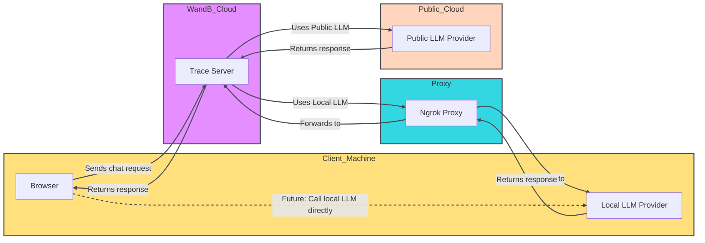

<Tip>
  한정된 시간 동안, 새로운 W\&B Inference 서비스가 무료 티어에 포함됩니다. W\&B Inference는 API 및 Weave Playground를 통해 주요 오픈소스 기반 모델에 대한 접근을 제공합니다.

  * [개발자 문서](../integrations/inference.mdx)
  * [제품 페이지](https://wandb.ai/site/inference)
</Tip>

LLM 프롬프트와 응답을 평가하는 것은 어려운 일입니다. Weave Playground는 LLM 프롬프트와 응답을 반복하는 과정을 단순화하도록 설계되어 다양한 모델과 프롬프트를 실험하기 쉽게 만듭니다. 프롬프트 편집, 메시지 재시도, 모델 비교와 같은 기능을 통해 Playground는 LLM 애플리케이션을 빠르게 테스트하고 개선하는 데 도움을 줍니다. Playground는 현재 OpenAI, Anthropic, Google, Groq, Amazon Bedrock, Microsoft Azure 및 [custom providers](#add-a-custom-provider).

* **빠른 접근:** W\&B 사이드바에서 Playground를 열어 새 세션을 시작하거나 Call 페이지에서 열어 기존 프로젝트를 테스트합니다.
* **메시지 컨트롤:** 채팅 내에서 직접 메시지를 편집, 재시도 또는 삭제합니다.
* **유연한 메시징:** 사용자 또는 시스템 입력으로 새 메시지를 추가하고 LLM에 전송합니다.
* **맞춤형 설정:** 선호하는 LLM 제공자를 구성하고 모델 설정을 조정합니다.
* **다중 LLM 지원:** 팀 수준 API 키 관리와 함께 모델 간 전환이 가능합니다.
* **모델 비교:** 다양한 모델이 프롬프트에 어떻게 응답하는지 비교합니다.
* **커스텀 제공자:** 커스텀 모델을 위한 OpenAI 호환 API 엔드포인트를 테스트합니다.
* **저장된 모델:** 워크플로우를 위한 재사용 가능한 모델 프리셋을 생성하고 구성합니다

Playground를 시작하여 LLM 상호작용을 최적화하고 프롬프트 엔지니어링 프로세스와 LLM 애플리케이션 개발을 간소화하세요.

* [사전 요구사항](#prerequisites)
  * [제공자 자격 증명 및 정보 추가](#add-provider-credentials-and-information)
  * [Playground 접근하기](#access-the-playground)
* [LLM 선택](#select-an-llm)
* [설정 사용자 지정](#customize-settings)
* [메시지 컨트롤](#add-retry-edit-and-delete-messages)
* [LLM 비교](#compare-llms)
* [커스텀 제공자](#custom-providers)
* [저장된 모델](#saved-models)

## 사전 요구사항

Playground를 사용하기 전에 [제공자 자격 증명 추가](#add-provider-credentials-and-information)하고 [Playground UI 열기](#access-the-playground)를 해야 합니다.

### 제공자 자격 증명 및 정보 추가

Playground는 현재 OpenAI, Anthropic, Google, Groq, Amazon Bedrock 및 Microsoft Azure의 모델을 지원합니다. 사용 가능한 모델 중 하나를 사용하려면 W\&B 설정에서 팀 시크릿에 적절한 정보를 추가하세요.

* OpenAI: `OPENAI_API_KEY`
* Anthropic: `ANTHROPIC_API_KEY`
* Google: `GEMINI_API_KEY`
* Groq: `GROQ_API_KEY`
* Amazon Bedrock:
  * `AWS_ACCESS_KEY_ID`
  * `AWS_SECRET_ACCESS_KEY`
  * `AWS_REGION_NAME`
* Azure:
  * `AZURE_API_KEY`
  * `AZURE_API_BASE`
  * `AZURE_API_VERSION`
* X.AI:
  * `XAI_API_KEY`
* Deepseek
  * `DEEPSEEK_API_KEY`

### Playground 접근하기

Playground에 접근하는 두 가지 방법이 있습니다:

1. *간단한 시스템 프롬프트가 있는 새로운 Playground 페이지 열기*: 사이드바에서 **Playground**를 선택하세요. Playground가 같은 탭에서 열립니다.
2. *특정 호출에 대한 Playground 열기*:
   1. 사이드바에서 **Traces** 탭을 선택하세요. 트레이스 목록이 표시됩니다.
   2. 트레이스 목록에서 보고 싶은 호출의 이름을 클릭하세요. 호출의 세부 정보 페이지가 열립니다.
   3. 클릭 **Open chat in playground**. Playground가 새 탭에서 열립니다.


## LLM 선택

왼쪽 상단의 드롭다운 메뉴를 사용하여 LLM을 전환할 수 있습니다. 다양한 제공자의 사용 가능한 모델은 아래에 나열되어 있습니다:

* [Amazon Bedrock](#amazon-bedrock)
* [Anthropic](#anthropic)
* [Azure](#azure)
* [Google](#google)
* [Groq](#groq)
* [OpenAI](#openai)
* [X.AI](#xai)
* [Deepseek](#deepseek)

{/* USE make update_playground_models */}

{/* LLM_LIST_START, DON'T EDIT THIS SECTION */}

### [Amazon Bedrock](../integrations/bedrock.mdx)

* ai21.j2-mid-v1
* ai21.j2-ultra-v1
* amazon.nova-micro-v1:0
* amazon.nova-lite-v1:0
* amazon.nova-pro-v1:0
* amazon.titan-text-lite-v1
* amazon.titan-text-express-v1
* mistral.mistral-7b-instruct-v0:2
* mistral.mixtral-8x7b-instruct-v0:1
* mistral.mistral-large-2402-v1:0
* mistral.mistral-large-2407-v1:0
* anthropic.claude-3-sonnet-20240229-v1:0
* anthropic.claude-3-5-sonnet-20240620-v1:0
* anthropic.claude-3-haiku-20240307-v1:0
* anthropic.claude-3-opus-20240229-v1:0
* anthropic.claude-v2
* anthropic.claude-v2:1
* anthropic.claude-instant-v1
* cohere.command-text-v14
* cohere.command-light-text-v14
* cohere.command-r-plus-v1:0
* cohere.command-r-v1:0
* meta.llama2-13b-chat-v1
* meta.llama2-70b-chat-v1
* meta.llama3-8b-instruct-v1:0
* meta.llama3-70b-instruct-v1:0
* meta.llama3-1-8b-instruct-v1:0
* meta.llama3-1-70b-instruct-v1:0
* meta.llama3-1-405b-instruct-v1:0

### [Anthropic](../integrations/anthropic.mdx)

* claude-3-7-sonnet-20250219
* claude-3-5-sonnet-20240620
* claude-3-5-sonnet-20241022
* claude-3-haiku-20240307
* claude-3-opus-20240229
* claude-3-sonnet-20240229

### [Azure](../integrations/azure.mdx)

* azure/o1-mini
* azure/o1-mini-2024-09-12
* azure/o1
* azure/o1-preview
* azure/o1-preview-2024-09-12
* azure/gpt-4o
* azure/gpt-4o-2024-08-06
* azure/gpt-4o-2024-11-20
* azure/gpt-4o-2024-05-13
* azure/gpt-4o-mini
* azure/gpt-4o-mini-2024-07-18

### [Google](../integrations/google.mdx)

* gemini/gemini-2.5-pro-preview-03-25
* gemini/gemini-2.0-pro-exp-02-05
* gemini/gemini-2.0-flash-exp
* gemini/gemini-2.0-flash-001
* gemini/gemini-2.0-flash-thinking-exp
* gemini/gemini-2.0-flash-thinking-exp-01-21
* gemini/gemini-2.0-flash
* gemini/gemini-2.0-flash-lite
* gemini/gemini-2.0-flash-lite-preview-02-05
* gemini/gemini-1.5-flash-001
* gemini/gemini-1.5-flash-002
* gemini/gemini-1.5-flash-8b-exp-0827
* gemini/gemini-1.5-flash-8b-exp-0924
* gemini/gemini-1.5-flash-latest
* gemini/gemini-1.5-flash
* gemini/gemini-1.5-pro-001
* gemini/gemini-1.5-pro-002
* gemini/gemini-1.5-pro-latest
* gemini/gemini-1.5-pro

### [Groq](../integrations/groq.mdx)

* groq/deepseek-r1-distill-llama-70b
* groq/llama-3.3-70b-versatile
* groq/llama-3.3-70b-specdec
* groq/llama-3.2-1b-preview
* groq/llama-3.2-3b-preview
* groq/llama-3.2-11b-vision-preview
* groq/llama-3.2-90b-vision-preview
* groq/llama-3.1-8b-instant
* groq/llama3-70b-8192
* groq/llama3-8b-8192
* groq/gemma2-9b-it

### [OpenAI](../integrations/openai.mdx)

* gpt-4.1-mini-2025-04-14
* gpt-4.1-mini
* gpt-4.1-2025-04-14
* gpt-4.1
* gpt-4.1-nano-2025-04-14
* gpt-4.1-nano
* o4-mini-2025-04-16
* o4-mini
* gpt-4.5-preview-2025-02-27
* gpt-4.5-preview
* o3-2025-04-16
* o3
* o3-mini-2025-01-31
* o3-mini
* gpt-4o-mini
* gpt-4o-2024-05-13
* gpt-4o-2024-08-06
* gpt-4o-mini-2024-07-18
* gpt-4o
* gpt-4o-2024-11-20
* o1-mini-2024-09-12
* o1-mini
* o1-preview-2024-09-12
* o1-preview
* o1-2024-12-17
* gpt-4-1106-preview
* gpt-4-32k-0314
* gpt-4-turbo-2024-04-09
* gpt-4-turbo-preview
* gpt-4-turbo
* gpt-4
* gpt-3.5-turbo-0125
* gpt-3.5-turbo-1106

### X.AI

* xai/grok-3-beta
* xai/grok-3-fast-beta
* xai/grok-3-fast-latest
* xai/grok-3-mini-beta
* xai/grok-3-mini-fast-beta
* xai/grok-3-mini-fast-latest
* xai/grok-beta
* xai/grok-2-1212
* xai/grok-2
* xai/grok-2-latest

### Deepseek

* deepseek/deepseek-reasoner
* deepseek/deepseek-chat

{/* LLM_LIST_END, DON'T EDIT THIS SECTION */}

## 설정 사용자 지정

### LLM 매개변수 조정

선택한 모델에 대해 다양한 매개변수 값을 실험할 수 있습니다. 매개변수를 조정하려면 다음을 수행하세요:

1. Playground UI의 오른쪽 상단 모서리에서 **채팅 설정**을 클릭하여 매개변수 설정 드롭다운을 엽니다.
2. 드롭다운에서 원하는 대로 매개변수를 조정합니다. Weave 호출 추적을 켜거나 끌 수도 있으며, [함수 추가](#add-a-function)를 할 수 있습니다.
3. 클릭 **채팅 설정**을 눌러 드롭다운을 닫고 변경 사항을 저장합니다.


### 함수 추가

사용자로부터 받은 입력을 기반으로 다양한 모델이 함수를 어떻게 사용하는지 테스트할 수 있습니다. Playground에서 테스트용 함수를 추가하려면 다음을 수행하세요:

1. Playground UI의 오른쪽 상단 모서리에서 **채팅 설정**을 클릭하여 매개변수 설정 드롭다운을 엽니다.
2. 드롭다운에서 **+ 함수 추가**를 클릭합니다.
3. 팝업에서 함수 정보를 추가합니다.
4. 변경 사항을 저장하고 함수 팝업을 닫으려면 오른쪽 상단 모서리의 **x**를 클릭합니다.
5. 클릭 **채팅 설정**을 눌러 설정 드롭다운을 닫고 변경 사항을 저장합니다.

### 시도 횟수 조정

Playground에서는 시도 횟수를 설정하여 동일한 입력에 대해 여러 출력을 생성할 수 있습니다. 기본 설정은 `1`입니다. 시도 횟수를 조정하려면 다음을 수행하세요:

1. Playground UI에서 설정 사이드바가 아직 열려있지 않은 경우 엽니다.
2. 조정 **시도 횟수**.

## 메시지 제어

### 메시지 재시도, 편집 및 삭제

Playground에서는 메시지를 재시도, 편집 및 삭제할 수 있습니다. 이 기능을 사용하려면 편집, 재시도 또는 삭제하려는 메시지 위에 마우스를 올립니다. 세 개의 버튼이 표시됩니다: **삭제**, **편집**, 그리고 **재시도**.

* **삭제**: 채팅에서 메시지를 제거합니다.
* **편집**: 메시지 내용을 수정합니다.
* **재시도**: 이후의 모든 메시지를 삭제하고 선택한 메시지부터 채팅을 다시 시도합니다.


### 새 메시지 추가

채팅에 새 메시지를 추가하려면 다음을 수행하세요:

1. 채팅 상자에서 사용 가능한 역할 중 하나를 선택합니다(**어시스턴트** 또는 **사용자**)
2. 클릭 **+ 추가**.
3. LLM에 새 메시지를 보내려면 **보내기** 버튼을 클릭합니다. 또는 **Command**와 **Enter** 키를 누릅니다.


## LLM 비교

Playground에서는 LLM을 비교할 수 있습니다. 비교를 수행하려면 다음을 수행하세요:

1. Playground UI에서 **비교**를 클릭합니다. 원래 채팅 옆에 두 번째 채팅이 열립니다.
2. 두 번째 채팅에서 다음을 수행할 수 있습니다:
   * [비교할 LLM 선택](#select-an-llm)
   * [매개변수 조정](#adjust-llm-parameters)
   * [함수 추가](#add-a-function)
3. 메시지 상자에 두 모델로 테스트하려는 메시지를 입력하고 **보내기**를 누릅니다.

## 사용자 지정 제공자

### 사용자 지정 제공자 추가

지원되는 [제공자](#select-an-llm) 외에도 Playground를 사용하여 사용자 지정 모델을 위한 OpenAI 호환 API 엔드포인트를 테스트할 수 있습니다. 예시는 다음과 같습니다:

* 지원되는 모델 제공자의 이전 버전
* 로컬 모델

Playground에 사용자 지정 제공자를 추가하려면 다음을 수행하세요:

1. Playground UI의 왼쪽 상단 모서리에서 **모델 선택** 드롭다운을 클릭합니다.

2. 선택 **+ AI 제공자 추가**.

3. 팝업 모달에서 제공자 정보를 입력합니다:

   * *제공자 이름*: 예를 들어, `openai` 또는 `ollama`.
   * *API 키*: 예를 들어, OpenAI API 키.
   * *기본 URL*: 예를 들어, `https://api.openai.com/v1/` 또는 ngrok URL `https://e452-2600-1700-45f0-3e10-2d3f-796b-d6f2-8ba7.ngrok-free.app`.
   * *헤더* (선택 사항): 여러 헤더 키와 값을 추가할 수 있습니다.
   * *모델*: 하나의 제공자에 대해 여러 모델을 추가할 수 있습니다. 예를 들어, `deepseek-r1`와 `qwq`.
   * *최대 토큰* (선택 사항): 각 모델에 대해 응답에서 생성할 수 있는 최대 토큰 수를 지정할 수 있습니다.

4. 공급자 정보를 입력한 후, **Add provider**를 클릭하세요.

5. Playground UI의 왼쪽 상단에 있는 **Select a model** 드롭다운에서 새 공급자와 사용 가능한 모델을 선택하세요.

<Warning>
  CORS 제한으로 인해 Playground에서 localhost나 127.0.0.1 URL을 직접 호출할 수 없습니다. 로컬 모델 서버(예: Ollama)를 실행 중인 경우, ngrok과 같은 터널링 서비스를 사용하여 안전하게 노출하세요. 자세한 내용은 [Use ngrok with Ollama](#use-ngrok-with-ollama)를 참조하세요.
</Warning>

이제 표준 Playground 기능을 사용하여 사용자 정의 공급자 모델을 테스트할 수 있습니다. 또한 사용자 정의 공급자를 [edit](#edit-a-custom-provider)하거나 [remove](#remove-a-custom-provider)할 수 있습니다.

### 사용자 정의 공급자 편집하기

이전에 생성한 [previously created custom provider](#add-a-custom-provider)의 정보를 편집하려면 다음을 수행하세요:

1. Weave 사이드바에서 **Overview**로 이동합니다.
2. 상단 탐색 메뉴에서 **AI Providers**를 선택합니다.
3. **Custom providers** 테이블에서 업데이트하려는 사용자 정의 공급자를 찾습니다.
4. 사용자 정의 공급자 항목의 **Last Updated** 열에서 편집 버튼(연필 아이콘)을 클릭합니다.
5. 팝업 모달에서 공급자 정보를 편집합니다.
6. **Save**를 클릭합니다.

### 사용자 정의 공급자 제거하기

이전에 생성한 [previously created custom provider](#add-a-custom-provider)를 제거하려면 다음을 수행하세요:

1. Weave 사이드바에서 **Overview**로 이동합니다.
2. 상단 탐색 메뉴에서 **AI Providers**를 선택합니다.
3. **Custom providers** 테이블에서 업데이트하려는 사용자 정의 공급자를 찾습니다.
4. 사용자 정의 공급자 항목의 **Last Updated** 열에서 삭제 버튼(휴지통 아이콘)을 클릭합니다.
5. 팝업 모달에서 공급자를 삭제할 것인지 확인합니다. 이 작업은 취소할 수 없습니다.
6. **Delete**를 클릭합니다.

### Ollama와 함께 ngrok 사용하기

Playground에서 로컬로 실행 중인 Ollama 모델을 테스트하려면 ngrok을 사용하여 CORS 제한을 우회하는 임시 공개 URL을 생성하세요.

설정하려면 다음을 수행하세요:

1. [Install ngrok](https://ngrok.com/docs/getting-started/#step-1-install)을 운영 체제에 맞게 설치하세요.

2. Ollama 모델을 시작하세요:

   ```bash
   ollama run <model>
   ```

3. 별도의 터미널에서 필요한 CORS 헤더가 포함된 ngrok 터널을 생성하세요:

   ```bash
   ngrok http 11434 --response-header-add "Access-Control-Allow-Origin: *" --host-header rewrite
   ```

ngrok이 시작된 후, `https://xxxx-xxxx.ngrok-free.app`와 같은 공개 URL이 표시됩니다. Playground에서 Ollama를 사용자 정의 공급자로 추가할 때 이 URL을 기본 URL로 사용하세요.

다음 다이어그램은 로컬 환경, ngrok 프록시 및 W\&B 클라우드 서비스 간의 데이터 흐름을 보여줍니다:



## 저장된 모델

### 모델 저장하기

워크플로우를 위한 재사용 가능한 모델 프리셋을 생성하고 구성할 수 있습니다. 모델을 저장하면 선호하는 설정, 매개변수 및 함수 후크와 함께 빠르게 로드할 수 있습니다.

1. LLM 드롭다운에서 공급자를 선택합니다.
2. 공급자 목록에서 모델을 선택합니다.
3. Playground UI의 오른쪽 상단 모서리에서 **Chat settings**를 클릭하여 채팅 설정 창을 엽니다.
4. 채팅 설정 창에서:
   * **Model Name** 필드에 저장할 모델의 이름을 입력합니다.
   * 원하는 대로 매개변수를 조정합니다. Weave 호출 추적을 켜거나 끌 수도 있으며, [add a function](#add-a-function)할 수 있습니다.
5. **Publish Model**을 클릭합니다. 모델이 저장되고 LLM 드롭다운의 **Saved Models**에서 접근할 수 있습니다. 이제 저장된 모델을 [use](#use-a-saved-model)하고 [update](#update-a-saved-model)할 수 있습니다.


### 저장된 모델 사용하기

이전에 [saved model](#save-a-model)로 빠르게 전환하여 실험이나 세션 전반에 걸쳐 일관성을 유지하세요. 이를 통해 중단한 지점부터 바로 시작할 수 있습니다.

1. LLM 드롭다운에서 **Saved Models**를 선택합니다.
2. 저장된 모델 목록에서 로드하려는 저장된 모델을 클릭합니다. 모델이 로드되고 Playground에서 사용할 준비가 됩니다.


### 저장된 모델 업데이트하기

기존 [saved model](#save-a-model)을 편집하여 매개변수를 미세 조정하거나 구성을 새로 고칠 수 있습니다. 이를 통해 저장된 모델이 사용 사례와 함께 발전할 수 있습니다.

1. LLM 드롭다운에서 **Saved Models**를 선택합니다.
2. 저장된 모델 목록에서 업데이트하려는 저장된 모델을 클릭합니다.
3. Playground UI의 오른쪽 상단 모서리에서 **Chat settings**를 클릭하여 채팅 설정 창을 엽니다.
4. 채팅 설정 창에서 원하는 대로 매개변수를 조정합니다. Weave 호출 추적을 켜거나 끌 수도 있으며, [add a function](#add-a-function)할 수 있습니다.
5. **Update model**을 클릭합니다. 모델이 업데이트되고 LLM 드롭다운의 **Saved Models**에서 접근할 수 있습니다.
